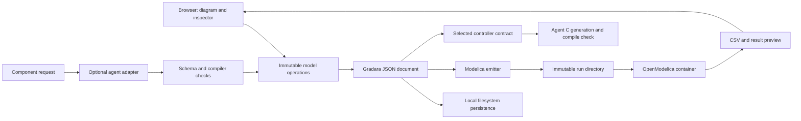

# Architecture

This document describes the implemented boundaries and the decisions behind them. Planned capabilities are listed separately under growth decisions and in the roadmap.

## Product decision

Build an independent web workbench over OpenModelica. Own the graphical interaction, component authoring, and export experience; reuse the Modelica compiler, numerical runtime, and a curated standard-library subset. Do not fork the compiler or build a new numerical solver before there is a demonstrated need.

The core interaction is creating a missing component where it belongs in a diagram and immediately connecting it. Direct manipulation remains the fastest path for ordinary editing. Monaco supports equation inspection and editing; MATLAB script compatibility is not a goal.

Agents author inspectable, saved component definitions and export artifacts. Ordinary code handles schemas, graph edits, connection laws, equation packaging, job supervision, and results. Numerical execution never asks an LLM to choose execution order or take a solver step.

## Implemented layers

| Layer | Implementation | Boundary |
| --- | --- | --- |
| Workbench | React 19, TypeScript, Vinext/Vite | Document/history orchestration in `app/page.tsx`; UI in `components/gradara/`. |
| Diagram | React Flow plus custom orthogonal net rendering | Transient pointer state and screen geometry; not the execution graph. |
| Model operations | `lib/gradara/` | Serializable document, names, nets, ports, routing, selection, immutable edit operations. |
| Equation editor | Monaco | Edits bounded component declarations and equations. |
| Local service | Python 3.12, FastAPI, Pydantic | Persistence, validation, source emission, asynchronous jobs, agent and export adapters. |
| Simulation | OpenModelica 1.27.0, OMPython, MSL 4.1.0 in Docker | Equation processing, initialization, integration, and events. |
| Storage | JSON documents and per-job filesystem directories | Single-user local persistence; no database or collaboration server. |

The Vite configuration retains Sites/Cloudflare build scaffolding. Its optional D1/R2 bindings are unset; application persistence and simulation use FastAPI and the local filesystem. A successful web build is not a deployable hosted simulation service.

## Model ownership

**Gradara JSON is the current authoring authority.** Blocks embed their definitions, parameters, and equations. Wires and junctions describe connectivity; nets give connected components persistent identity and labels. The generated `workspace.mo` and run-local `model.mo` are executable projections, not independent editable sources of truth.

Stable document, block, port, wire, junction, and net identities serve different purposes. Human names and geometry may change without changing equations. React Flow node/edge objects are derived views and must not become saved solver state. See the [model format](docs/architecture/MODEL_FORMAT.md).

Saving uses temporary files and per-file atomic replacement. Each model has its own canonical document file; a separate workspace file records the last explicitly activated model. Document writes and activation are separate API operations. Frontend writes are serialized and carry an expected content-hash save version. A stale write receives HTTP 409 and can be recovered as a copy; this is conflict detection, not collaborative merging. The local service uses one process; this check/write protocol does not claim coordination across multiple server workers. Each browser tab retains its own active document and optional recovery draft in session storage. See the document contract for legacy and Trash behavior.

The source-derived `semantic_hash` excludes presentation; latest results must match both that hash and the document ID. The separate `project_key` is a broader graph key and retains some definition metadata. There is no compiled-binary cache, and the current hash is not a cross-engine cache contract.

## Interaction architecture

Pointer previews are local and frame-batched. A completed gesture commits one document change and one undo step. Autosave, source emission, agent calls, and simulation do not belong in the pointer-move loop. Preserve user geometry, labels, and explicitly chosen wire paths when changing numerical definitions.

Shared geometry lives in `ports.ts` and `block-design.ts`. Library previews, the canvas, and the catalog use `BlockFace`. The [block design contract](docs/blocks/DESIGN.md) and [wiring contract](docs/architecture/WIRING.md) cover the detailed rules.

React Flow 12.11.6 requires a narrow, version-checked observer patch applied by `scripts/patch-react-flow.mjs` during install. It moves node-measurement publication to an animation frame. It does not suppress native errors. Read [the patch notes](patches/README.md) before upgrading React Flow.

Smooth interaction is a product requirement. Large-model frame-rate and latency budgets still need measured reference workloads; no 1,000-block performance claim is established.

## Simulation boundary

The Python service validates the document, checks connected scalar inputs, emits Modelica, and launches a supervised container using an immutable snapshot. Signal nets have at most one output driver; physical nets use Modelica potential/flow connection semantics. A visual junction is not an executable block, and canvas order is not evaluation order.

Built-in, non-generated physical `kind` values select canonical wrappers in `server/modelica.py`. Their display equations are explanatory; editing that text does not replace their physical implementation. Signal definitions and generated physical definitions use their bounded declarations and equations. Generated physical ports emit standard electrical pins, rotational flanges, or heat ports. Built-in physical additions use the canonical wrapper contract; generated additions use typed standard connectors and bounded equations. Assigning a domain color alone does not create physical connectivity.

The API exposes jobs rather than blocking the editor. Current concurrency, cancellation, diagnostics, result sampling, and file ownership are described in [simulation and agent execution](docs/architecture/EXECUTION.md) and the [API guide](docs/API.md).

## Agent and export boundary

The component adapter returns structured JSON constrained by the user-selected signal, electrical, rotational mechanical, thermal, or multidomain type. The server enforces terminal domains and directions independently of the provider, and refinement preserves the existing wired interface. Pydantic validates the definition, and OpenModelica checks it before insertion. Compiler diagnostics can trigger one repair attempt. The generated response is data, not a project-editing command. The browser applies the accepted component through its normal operations.

C export currently targets **one block marked `controller`**. The package includes its equations, parameters, local connection information, project revision, and a C11 init/step interface. Generated source is compiled in a container; the package retains the exact source and integration notes. Generation itself is not reproducible, and compile success proves neither behavioral equivalence nor hardware readiness.

This export is separate from OpenModelica's generated simulation C. A future controller-subsystem boundary must preserve controller structure and sample timing before the simulation compiler flattens the plant and controller.

Full-model creation uses `server/model_agent.py` to plan against a catalog snapshot, await checked missing components through the existing creator, assemble catalog references into a validated document, and require a successful trial simulation. The browser previews the result and saves it as a separate model on acceptance. See [execution](docs/architecture/EXECUTION.md#full-model-generation) for limits and ownership.

## Growth decisions

| Future capability | Prerequisite |
| --- | --- |
| Hierarchical models and controller export | Explicit subsystem boundaries, port mapping, paths, state and clock ownership, and migrations. |
| Modelica source round trips | A defined editable subset and a single-authority reconciliation design; no silent dual writing. |
| Remote execution | Authentication, authorization, isolation, quotas, durable jobs, versioned requests and artifacts. |
| FMI or another numerical backend | A concrete interoperability requirement and a capability contract; Modelica equation semantics are not universally interchangeable. |
| Verilog/VHDL | Clocks, resets, numeric representation, latency, synthesis checks, and behavioral comparisons. |
| Desktop distribution | Verified installers and process lifecycle on each OS, plus dependency/license packaging. Electron is an option, not an implemented commitment. |

Keep these boundaries modular within the current application. Microservices, an intermediate language, or a Rust solver are not prerequisites for improving the workbench. The [roadmap](ROADMAP.md) orders the next work.

## Upstream references

- [OpenModelica 1.27.0](https://github.com/OpenModelica/OpenModelica/releases/tag/v1.27.0) and [OMPython](https://github.com/OpenModelica/OMPython).
- [Modelica Standard Library 4.1.0](https://github.com/modelica/ModelicaStandardLibrary/releases/tag/v4.1.0) and [Modelica 3.6 specification](https://specification.modelica.org/maint/3.6/MLS.pdf).
- [React Flow](https://github.com/xyflow/xyflow); Gradara keeps its engineering wire behavior in this repository.
- [Third-party licensing](THIRD_PARTY_NOTICES.md). Process separation is an engineering choice, not a determination of distribution license obligations.

## Local generated-block library

`server/component_library.py` stores checked generations as immutable, content-addressed JSON under ignored `projects/components/`; identical definitions deduplicate. Changed definitions produce new entries. The library and block design catalog load this collection through `/api/components/library`, and insertion copies a definition into the ordinary model document. Model execution remains independent of library availability. Existing generated blocks in saved models are imported once with explicit unverified provenance. No private generated definitions are added to the repository or published.
