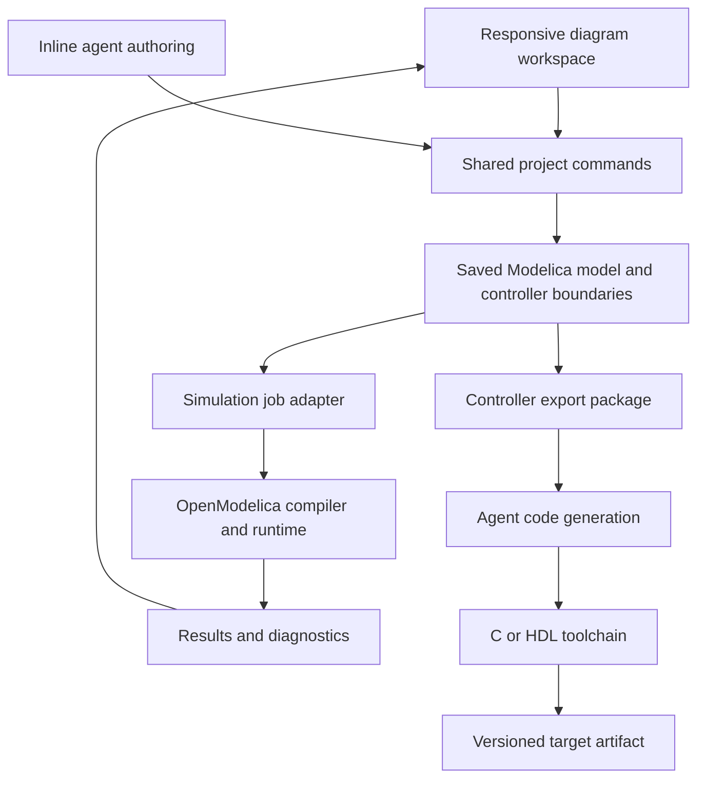

# Architecture decision: an agent-assisted multidomain workbench

Decided 9 September 2026. This document supersedes the earlier conditional proposal and platform-evaluation sprint. It records the chosen implementation path. The first local demo now implements the diagram, actual OpenModelica execution, agent-created signal components, Monaco inspection, persistence, and single-controller C export. See README.md for the delivered scope and current boundaries.

## Decision

Build an independent web workbench over OpenModelica. Own the graphical interaction, inline agent experience, component packaging, and export workflow. Reuse the existing Modelica compiler, numerical runtime, and a curated Modelica Standard Library subset. Use an unmodified stable engine release, initially OpenModelica 1.27.0.

The product is organized around building, understanding, and running multidomain diagrams. Its defining interaction is asking for a missing component where it belongs in the diagram, then connecting and using it immediately. Monaco is an optional inspector for equations and source. MATLAB script compatibility is outside scope.

The owner's working assumption is that the agent supplies the intended equations and target code. The first product work therefore emphasizes interaction quality and integration. Ordinary schema, interface, and compiler checks make generated artifacts usable. Independent physics validation and formal code equivalence are outside the initial milestone.

Agents author saved components and export artifacts. The conventional compiler and runtime handle equation processing, initialization, numerical stepping, events, and execution dependencies. Running a saved model does not call an LLM to interpret its behavior.

## Chosen stack

| Layer | Technology | Responsibility |
| --- | --- | --- |
| Workbench | React, TypeScript, Vite | Diagram workspace, palette, inspector, inline agent controls, run results. |
| Diagram foundation | React Flow with custom nodes and edges | Navigation and interaction primitives, engineering wires, ports, branching, selection, keyboard editing. |
| Source inspector | Monaco | Inspect and edit generated components and exported code without making a code editor the main workspace. |
| Application service | Python, FastAPI | Project files, agent tools, engine supervision, jobs, result access. |
| Simulation | OMPython and OpenModelica | Compile and execute Modelica models in supervised processes. |
| Component library | Curated Modelica Standard Library and project components | Electrical, mechanical, thermal, fluid, and signal/control building blocks, introduced incrementally. |
| Initial execution | Browser UI plus local application service | Local model files and native simulation; UI operations stay local. |
| Desktop packaging | Electron | Package the same workbench and native dependencies for Windows, macOS, and Linux after the browser workflow works. |
| Project storage | Modelica source, standard annotations, JSON manifests, binary results | Portable models, stable identities, project settings, dependency versions, run and export records. |

OMPython already exposes model loading, inspection, checking, building, simulation, parameters, and results. Python supervises the engine; compiled numerical execution is handled by OpenModelica. [OMPython documentation](https://openmodelica.org/doc/OpenModelicaUsersGuide/latest/ompython.html).

The Modelica Standard Library supplies an established starting point across the required domains. Expose a small, deliberately chosen palette first and expand it as the interface supports more component types. [Library documentation](https://build.openmodelica.org/Documentation/Modelica.html).

React Flow supplies primitives, while the engineering interaction design remains our work. Keep renderer-specific node/edge objects out of saved model semantics and engine contracts. [React Flow examples](https://reactflow.dev/examples), [performance guidance](https://reactflow.dev/learn/advanced-use/performance).

## Product interaction

The canvas occupies the main workspace. A searchable palette, contextual properties, and collapsible results support it. Agent interaction is available at the current selection or a dangling connection; a persistent chat panel is secondary.

The first complete interaction should feel like this:

1. Open a motor, load, sensor, and controller example.
2. Drag a signal into empty space, or double-click the canvas, and type: “Create a speed controller with proportional and integral gains and an output limit.”
3. The agent receives nearby port information and produces a preview with named ports, parameters, and a short behavior description.
4. Insert it as one undoable action. Existing compatible connections remain attached when the component is revised.
5. Select the block and ask: “Add a rate limit.” See the proposed local change, apply it, and keep working.
6. Run the simulation and inspect current, speed, and controller output in linked plots.
7. Open equations or source only when useful.

Parameters, connections, and layout stay directly editable with the mouse and keyboard. Common edits should not require a prompt. The agent uses the same editing commands as the user, preserving selection, layout, undo, and model identity.

## Responsiveness is a design constraint

Pan, zoom, dragging, selection, wire previews, and property editing execute immediately in the frontend. Neither compilation, the application service, nor an agent response belongs in the pointer-interaction path.

Use custom orthogonal wires, useful hit areas, predictable snapping, wire branching, reconnect gestures, block insertion, and keyboard shortcuts. Preserve manually arranged diagrams when an agent makes a local edit. Handle signature changes by showing which connections need attention.

Aim for 60 frames per second during ordinary interaction on the agreed reference machine. Measure 100- and 1,000-component examples early; these are test workloads, not claims of achieved capacity. Memoize node rendering and subscribe narrowly to editor state. Move costly routing/layout work to a worker if profiling calls for it.

Compilation and simulation run asynchronously with visible progress and cancellation. Moving a block does not trigger recompilation. Cache compilation using semantic model inputs, library versions, engine configuration, and structural parameters; rerun with changed runtime parameters when supported by the engine. Plot requested, downsampled series and retain full results outside React state.

A web interface does not imply browser-only computation. Native numerical tools run locally first. Later remote execution uses the same job request and result contract.

## Model ownership and editing

Saved Modelica source is authoritative for equations, component instances, connections, and simulation behavior. The UI holds an editable working projection with stable component and port IDs. Standard diagram annotations carry supported portable layout; sidecars hold application-specific UI and export metadata.

Support the Modelica editing subset needed by our own workbench and packaged components. Complex library components can remain encapsulated. Full graphical round-trip editing of arbitrary imported Modelica source is not an initial requirement.

Use existing compiler inspection and editing APIs where suitable, including getModelInstance and connection operations. UI drafts and local layout changes remain responsive while semantic edits synchronize asynchronously. Check project revisions before applying agent changes; merge independent edits and report conflicting changes without overwriting current work. [Instance API](https://build.openmodelica.org/Documentation/OpenModelica.Scripting.getModelInstance.html), [connection API](https://build.openmodelica.org/Documentation/OpenModelica.Scripting.addConnection.html).

Model commands include addComponent, connectPorts, setParameter, replaceComponentDefinition, createSubsystem, undo, and run. A logical change is an atomic transaction. Both graphical edits and agent tools invoke these commands.

Do not use React Flow's graph as a numerical execution plan. Modelica semantics remain an intentional commitment. A small engine adapter isolates loading, checking, compilation, runs, cancellation, and diagnostics; it does not promise that arbitrary solvers are interchangeable.

## Generated component contract

The agent returns a structured component definition with:

- Name, description, and stable port identities.
- Named inputs and outputs, types, dimensions, and applicable units.
- Parameters and defaults.
- State variables and initial values, when needed.
- Algebraic equations, continuous state equations, or discrete update expressions with sample timing.
- Simple presentation metadata such as port order and icon choice.

Use Modelica expressions and equation sections inside this contract, with templated declarations and packaging. This is a generation interface, not a new general-purpose language or numerical interpreter. Convert accepted definitions into ordinary Modelica components and store their exact source. Later edits read the saved definition; original generation responses are provenance, not a second executable authority.

Check the response structure, referenced names, connector compatibility, and whether the component and assembled model compile. Feed integration errors back to the agent for repair. A successful artifact can be inserted without an additional physics-approval process. Creation and regeneration produce explicit revisions; simulation uses the selected saved revision.

A generic input/output component is suitable for control laws and many custom behaviors. Physical components also need Modelica's physical connectors: for example, electrical potential/current or mechanical position/torque. Sensors and actuators connect these physical networks to signal-based controllers. Retaining these two connector categories is essential to the multidomain design. [Modelica connection semantics](https://specification.modelica.org/maint/3.6/MLS.pdf).

Initially generate signal/state components and reuse existing physical components. Extend the same creation interaction to generated physical components once their connector contract is exposed in the UI.

## Export is part of the model design

Make “Controller subsystem” a first-class concept from the first end-to-end milestone. The physical plant is the environment that controller operates against. A controller can be selected, edited, simulated, and later exported as a unit.

Its export description includes the boundary inputs/outputs, resolved component definitions and connections, parameter values, state and initialization/reset behavior, and sampling rules. Target settings add the numeric representation, platform interface, and relevant clock/latency choices. Derive behavior from the saved model and record target-specific decisions alongside it. Preserve the controller boundary even if the simulation compiler later flattens the overall plant and controller together.

The agent may propose missing target settings, including a discretization for continuous controller dynamics. Save the resulting controller revision and show the choices in export properties. Start with one sample rate and fixed-size signals. This gives the generator sufficient context without requiring a new deterministic code-generation compiler.

The export workflow is:

1. Select the controller subsystem and a target.
2. Build an export package from its saved equations, state, connections, interface, and target settings.
3. Ask the agent to generate target source from that package.
4. Compile or elaborate it using the target toolchain, reporting and repairing structural failures.
5. Save the exact generated code, model revision, target configuration, and build information as an export artifact.

Implement C first, with a header and explicit initialization/reset and step functions, usable from C++ as well. Add Verilog next, with clock/reset, signal interfaces, and declared latency. VHDL can follow through the same export contract. Regeneration creates a new artifact; exports remain inspectable and reproducible from their saved source.

At this stage, trust that generated behavior matches the requested design, as the owner directed. Compiler success establishes buildability, not equivalence or hardware timing. More extensive comparison, synthesis, and target validation can be added without changing the authoring architecture.

OpenModelica's simulation C output is separate from this controller export feature. The export package retains the user's useful controller structure and equations before engine flattening. [OpenModelica simulation API](https://git.openmodelica.org/Documentation/OpenModelica.Scripting.simulate.html).

## Architecture flow

Keep the service as a modular application with supervised engine jobs. Separate the editor, model commands, agent adapter, simulation adapter, and export package interfaces within one codebase. Use immutable model snapshots for jobs. Introduce a remote worker when deployment requires it; tightly coupled physical equations remain together in a numerical runtime.

Use Python for imports, sweeps, fitting, and results processing. Add external component execution or FMI interoperability for a specific integration requirement. Defer a second engine and a new Rust solver until a demonstrated runtime requirement calls for them.

## Build sequence

1. **Canvas and component-creation experience.** Build the motor example workspace with polished wiring, pan/zoom, selection, keyboard editing, undo, inline creation preview, component properties, and equation inspection. Temporary fixtures must be visibly distinguished from connected simulation results.
2. **Complete the real loop.** Connect the same model to OpenModelica, generate a new controller component through the agent, save/reopen it, run it, and inspect current/speed/output. Keep the controller boundary and timing in the project model.
3. **Make the workflow pleasant under load.** Measure interaction and rerun latency, improve wire behavior and diagrams with many components, support cancellation/recovery, and package the application across the three desktop operating systems.
4. **Deliver controller export.** Generate and build C from the selected controller. Add Verilog through the same package boundary, then VHDL. Expand physical-domain coverage as the component workflow matures.

The immediate deliverable is one convincing end-to-end experience, with most custom development effort going into the workbench. No platform bake-off, general compiler project, or broad component-library expansion precedes that experience.

## Research behind the choice

Similar product ideas already exist, including ODE+ and Modelon Impact, and OpenModelica has experimental agent support in OMEdit. The decision to build our workbench follows the owner's desire to shape the interaction and export workflow directly. It is not a claim that competitors lack these features or that a commercial market gap has been proven. [Modelica industry newsletter](https://modelica.org/newsletter/2026-02/), [Modelon agent announcement](https://www.modelon.com/blog/from-ai-guidance-to-agentic-simulation-in-modelon-impact/), [OpenModelica 1.27.0 release](https://github.com/OpenModelica/OpenModelica/releases/tag/v1.27.0).

Reuse OpenModelica as a dependency rather than maintaining a fork of its compiler or desktop IDE. OpenModelica 1.27.0 offers AGPL v3 and OSMC-PL 1.8 licensing paths, with separate runtime terms. Distribution must follow the selected components' actual licenses; process separation is an engineering boundary. [Compiler license](https://raw.githubusercontent.com/OpenModelica/OpenModelica/v1.27.0/OSMC-License.txt), [runtime license](https://raw.githubusercontent.com/OpenModelica/OpenModelica/v1.27.0/OSMC-Runtime-License.txt).

## Canvas interaction contract

The saved project owns numerical definitions, connections, position, and optional block size. `ModelCanvas` owns transient drag/resize state and React Flow's measured dimensions. Apply all node-change events; discarding measurement events breaks node initialization. Paint those changes at a frame boundary, and commit a complete gesture once to the document/history. Autosave, equation emission, the inspector, and plots do not run on every pointer movement. Position and size are excluded from numerical identity.

Use the same layout command for resize handles and inspector size fields. Undo/redo captures immutable snapshots before scheduling React updates. Name and numeric inputs commit on Enter or blur; Escape cancels the draft. The initial fit waits for both the loaded project and initialized canvas dimensions.

React Flow 12.11.6's node observer also needed a narrow timing correction: publishing its internal store updates during ResizeObserver delivery produced repeatable loop errors while resizing. `scripts/patch-react-flow.mjs` applies the version-pinned ESM patch on install. It batches that observer's measurements into the next animation frame, cancels pending work on unmount, and leaves native errors visible. An upgrade fails the patch check until explicitly reviewed. No global observer replacement or error suppression is shipped.

Simulink remains the usability benchmark. This pass establishes basic editing behavior; it does not establish parity in obstacle-aware wire routing, alignment tools, large-diagram performance, or library breadth.
