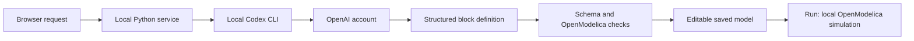

# Enable AI features

Gradara currently uses **your own local Codex CLI and account** to create or refine blocks and generate controller C. There is no Gradara-hosted AI service, shared maintainer account, or bundled AI allowance. Cursor and the Codex desktop application are optional editors, not prerequisites.

| What you want to do | What it needs |
| --- | --- |
| Edit, wire, save, and reopen models | Browser and local Gradara service. |
| Simulate built-in or previously generated blocks | Local service and Docker/OpenModelica; no AI account. |
| Ask for a new block or refine one | Signed-in Codex CLI, provider connectivity, and Docker for compiler checks. |
| Generate C for one controller block | The same agent setup and Docker for C compilation. |

Complete [local setup](development/SETUP.md) first. macOS is exercised; Linux remains a validation target, and Windows users should use WSL2 for the full workflow.

## Connect your account

Install the public CLI in the same environment where you run the Python service. This pinned version's command-line options were checked on 2026-09-13:

```sh
npm install -g @openai/codex@0.154.0
codex --version
codex login
codex login status
```

Complete the browser sign-in using your own account. OpenAI supports ChatGPT sign-in for subscription access and API-key sign-in for usage-based access; eligibility, limits, and billing follow that account. For API-key login, follow the [official authentication guide](https://learn.chatgpt.com/docs/auth). Keep credentials in the CLI's credential storage, outside Gradara models and repository files. See also [official CLI installation](https://learn.chatgpt.com/docs/codex/cli).

From the Gradara repository, launch with the executable you just checked:

```sh
export GRADARA_CODEX_BIN="$(command -v codex)"
.venv/bin/python scripts/start.py
```

If Gradara is already running, stop it with `.venv/bin/python scripts/stop.py` before restarting. Executable discovery happens when the service starts; changing PATH or an environment variable does not update an existing service. The Python service does not automatically load `.env` files.

Run the service as the same OS user who signed in. If you intentionally use a custom `CODEX_HOME`, set it in that launching shell too. Gradara preserves it for CLI authentication. The adapter otherwise ignores user `config.toml` and does not pass a model selection: your editor's chosen model or custom provider profile will not automatically carry over.

The public `0.154.0` executable's version and `exec --help` were checked against the adapter's flags. This is a CLI compatibility check, not a completed generation using a fresh account. Upgrade instructions should retain that distinction until a public-CLI generation and compiler check are recorded.

## Try your first generated block

1. Start a blank model and open the agent composer.
2. Choose **Signal / control** in **Block type**, then ask: “A first-order low-pass filter with scalar input u, output y, and a 50 ms time constant.”
3. Wait for generation and the OpenModelica check. The successful definition is inserted into the diagram through normal model editing.
4. Connect a Step block to its input, set a suitable stop time, and run the model. Inspect the output in Results.

The generated equations become part of the saved document. Reopening, sharing, and simulating that block do not require another AI call. Asking for a revision or generating C does.

## What runs where



The agent authors bounded equations. Conventional code packages connectivity, supervises compilation, and executes the simulation. Choose Signal / control, Electrical, Mechanical (rotational), Thermal, or Multiple physical domains before generation. The selected type constrains the provider schema and server validation. Physical blocks have real Modelica terminals, and may also expose scalar signal ports. Refinement preserves the type and existing terminal IDs, domains, and directions. Arbitrary connector families, translational mechanics, whole subsystems, and HDL generation are not implemented. C export targets one controller block and checks compilation; see the [execution contract](architecture/EXECUTION.md).

Generation sends the prompt and relevant definition to the provider; refinement and repair can include prior candidates and compiler diagnostics. C export includes its controller contract. Local generation artifacts are retained under `projects/agent/`. Read [data handling](../SECURITY.md) before sharing logs. Ordinary simulation does not call the provider.

## If it does not work

| Symptom | Check |
| --- | --- |
| Agent unavailable | Check `command -v codex`, set `GRADARA_CODEX_BIN`, and restart the service. |
| Ready status but generation fails | `agentReady` only means an executable was found. Check `codex login status`, network access, account limits, and the reported error. |
| Unknown command-line option | Check the selected binary's `--version` and `exec --help`; an older CLI may lack required flags. |
| Login works in a different terminal only | Check the service's OS user, executable, and `CODEX_HOME`. User-configured credential-store settings are not carried over by `--ignore-user-config`. |
| Environment-only API key does not work | Authenticate the CLI first. The adapter filters most `CODEX_*` variables, including `CODEX_API_KEY`; exporting that variable is not a supported shortcut. |
| Candidate fails compiler checks | Check Docker/engine availability and the job diagnostic. The service permits one compiler-driven repair, then reports failure. |
| Long-running request | Each CLI call has a 180-second timeout. Compilation and a repair can extend total job duration. Native Windows agent cancellation is unfinished; use WSL2. |

## Next steps for the infrastructure

The current local CLI approach is suitable for early testers. A polished release needs an in-app setup screen that distinguishes installation, authentication, and engine readiness, plus useful account/connection errors. It also needs explicit model selection.

Keep a small structured-generation interface between Gradara and providers: prompt, schema, cancellation, result, and diagnostics. The current shared function is `server/agent.py:structured_generation`; it is Codex-specific today. A future provider adapter can sit behind that boundary while the block schema, compiler checks, and simulation path remain shared. Other providers, local models, and a hosted relay are proposals, not supported configuration options. See the [roadmap](../ROADMAP.md).

The repository's [AGENTS.md](../AGENTS.md) and [task playbooks](agents/PLAYBOOKS.md) are separate instructions for coding agents contributing to Gradara. End users do not need to configure those files to generate a block.
