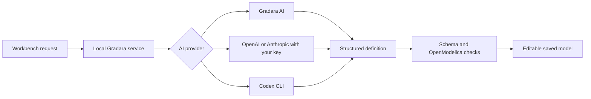

# AI features

AI in Gradara is optional. Drawing, wiring, simulating, reopening models, and exporting Modelica or C code for library blocks never need AI or an account.

## What AI can do

Every request starts in the **Ask bar** (press **A**), and answers arrive as cards in the **Proposals** tab.

- **Create a block** from a description, such as "a first-order low-pass filter with a 50 ms time constant". Gradara guesses the block type (signal, electrical, rotational, translational, magnetic, thermal, or several domains) and you can change it.
- **Build a complete model** from a description of a system or circuit (**Build model**).
- **Edit the open model** (**Edit model**), for example "add a speed sensor on the load shaft".
- **Explain or fix a failed run** (**Explain problems**, **Fix problems**), from the **Problems** tab.
- **Explain results**: ask about stored runs, such as "why does the current overshoot?". Gradara sends a summary it computes on your computer, never the samples, and rechecks every number in the answer against the stored data.
- **Write a C template** for a custom block, so it can be included in a C code export.

Every AI result is checked before you see it. Generated blocks must pass OpenModelica's compiler. Model edits and full models must also pass a trial simulation. So the simulation engine must be ready (**Settings → Engine** shows its status). **Explain problems** only reads the problems and does not compile anything; **Explain results** reads stored runs and does not simulate. You always review a proposal before it changes your model. See the [user guide](USER_GUIDE.md#ai-features) for how each feature works.

Passing these checks does not make a block physically correct. Review generated equations as you would any model.

## Choose a provider

Open **Settings → AI** and pick one:

| Provider | Setup | Who bills you |
| --- | --- | --- |
| **Gradara AI** (recommended, the default) | Choose **Sign in**. Your browser opens a page; sign in with Google or an email link and confirm the code shown in Gradara. Gradara never sees a password. | Prepaid Gradara AI credits |
| **OpenAI API key** | Paste your key. Gradara checks it with a free request and stores it in your system's keychain. Optionally enter a model name. | OpenAI, under your account |
| **Anthropic API key** | Same as OpenAI. | Anthropic, under your account |
| **Off** | Turns AI requests off. AI buttons stay visible and report that AI is off. | Nobody |

A developer option, the Codex CLI, appears only when it is installed; see [For developers](#for-developers).

## Gradara AI credits

New accounts get **20 free credits**. After that, buy prepaid packs in **Settings → AI**:

| Pack | Price |
| --- | --- |
| 100 credits | $10 |
| 550 credits | $50 |

Checkout opens in your browser and is handled by Stripe. Gradara never receives your card details. Your balance updates when you return to the app. There is no subscription. Credits do not expire while your account is active.

### What each task costs

| Task | Credits |
| --- | --- |
| Generate a block | 2 |
| Build a complete model | 20 (covers every block it creates) |
| Model edit | 4, plus 2 for each new or rewritten block (at most three blocks) |
| Explain problems | 2 |
| Fix problems | The explanation plus the edit |
| Explain results question | 2 (extra measurements included) |
| C template for a custom block | 2 |

Automatic repair attempts are included in the price. **If a request, or a block within an edit, fails before producing output, you are not charged for it.** The Ask bar shows the cost and your balance before you send, and each answer in Proposals shows what it actually cost. C code for library blocks is generated without AI and costs nothing.

### Refunds, account, and terms

Within 14 days of a purchase, the unused credits from that purchase can be refunded on request. Email **support@virtu-services.us** from your account email. Credits you have already used, and the 20 welcome credits, are not refunded.

**Delete account** in **Settings → AI** erases your email, usage history, and sign-ins, and forfeits any remaining credits. Ask for a refund first if you are eligible. Your models on your computer are not affected.

Gradara AI is provided by Virtu Services LLC under the [Terms](https://gradara.app/terms.html) and the [Privacy notice](https://gradara.app/privacy.html). The Terms govern purchases and refunds.

## What is sent, and what is kept

Only when you use an AI feature, Gradara sends the request and the relevant part of your model to the provider you chose:

- **Blocks**: your description and, when refining or repairing, the current definition and compiler messages.
- **Model edits and diagnosis**: your request, the open model without its layout, the names of selected blocks, and the block library. Refining a proposal also sends your earlier request and the changes it proposed. A diagnosis of a failed run also sends that run's Modelica source and solver messages.
- **Explain results**: your question; a summary Gradara computes on your computer from the runs on show (run names, statistics and events per signal, an outline of each signal of at most 900 points in all, the differences between the runs and their parameters, the first run's solver warnings, and the names and units of up to 60 recorded signals); the run's model without its layout; and up to four earlier questions and answers of that discussion. If the AI asks for up to four extra measurements, Gradara computes them locally and sends the results. Recorded samples and CSV files are never sent. **Show what will be sent** in the Ask bar shows the exact text.
- **C templates**: the custom block's definition.

Ordinary simulation never calls a provider. With your own API key, requests go directly to OpenAI or Anthropic under your account's terms. The Gradara AI service keeps your email, credit balance and purchases, and per-request counts (task, model, token counts, time). It does not store or log your prompts, models, equations, or AI responses; its AI provider, Anthropic, may keep them briefly for abuse and safety monitoring. See [privacy](PRIVACY.md) for the full details.

## Try your first generated block

1. Start a blank model and press **A** (or choose **Ask AI**), then choose **Create block**.
2. Ask: "A first-order low-pass filter with scalar input u, output y, and a 50 ms time constant." Check that the **Type** menu says **Signal / control**.
3. Wait for generation and the OpenModelica check. The **New block** card in Proposals shows the terminals and equations; choose **Add to model**.
4. Connect a **Step** to its input, set a stop time of about 0.5 s, and run. Look at the output in **Results**.

The generated equations are saved in your model. Reopening, sharing, and simulating the block need no further AI. The block is also saved in **Library → AI blocks** for reuse.

## What AI cannot do yet

Generated blocks cannot have Boolean or 3-phase ports and cannot wrap Modelica Standard Library components (the built-in library already covers many of them). The model builder creates flat models without subsystems, with up to 80 blocks and four new block types per request. Edits, diagnosis, and fixes work on the top level of a model, not inside subsystems. HDL generation is not available. When a request is beyond Gradara, the answer says so and offers **Improve Gradara…**, which opens a public GitHub issue with your request.

Changes to Gradara itself can also be built for you as [personal features](USER_GUIDE.md#personal-features). They run on the workshop repository's own AI key, not on Gradara AI credits.

## If it does not work

See [Troubleshooting → AI sign-in and credits](development/TROUBLESHOOTING.md#ai-sign-in-and-credits).

## For developers

### Codex CLI

The Codex CLI is a developer option. Install it where the Gradara service runs:

```sh
npm install -g @openai/codex@0.154.0
codex login
export GRADARA_CODEX_BIN="$(command -v codex)"
.venv/bin/python scripts/start.py
```

Source checkouts default to Codex when the CLI is found and to Gradara AI otherwise. `GRADARA_AI_PROVIDER` overrides the saved choice. The adapter ignores the user's `config.toml`, filters most `CODEX_*` variables (except `CODEX_HOME`), and keeps prompts and responses under `projects/agent/` for debugging. Other providers keep nothing on disk unless `GRADARA_KEEP_AI_TRANSCRIPTS=1`.

### What runs where


```mermaid
flowchart LR
    UI[Workbench request] --> API[Local Gradara service]
    API --> Choice{AI provider}
    Choice --> GW[Gradara AI]
    Choice --> Vendor[OpenAI or Anthropic with your key]
    Choice --> CLI[Codex CLI]
    GW --> JSON[Structured definition]
    Vendor --> JSON
    CLI --> JSON
    JSON --> Check[Schema and OpenModelica checks]
    Check --> Model[Editable saved model]
```

The AI writes bounded equations. Ordinary code packages the connections, runs the compiler, and executes the simulation. The selected block type constrains the provider's output schema and the server's validation. Physical blocks get real Modelica terminals and may also have signal ports. Refinement keeps the type and the existing terminal IDs, domains, and directions.

A full-model request may call the provider several times: library planning, each missing block (with an optional repair), assembly, and one optional assembly repair. A model edit plans the change, generates any new or rewritten blocks (each with its own compile check), applies the operations locally, and runs a trial simulation, with one automatic revision. Explain results calls the provider once, or twice when it asks for measurements, and repairs an answer that does not match the schema. See the [execution contract](architecture/EXECUTION.md) and the [distribution guide](architecture/DISTRIBUTION.md).

The repository's [AGENTS.md](../AGENTS.md) and [task playbooks](agents/PLAYBOOKS.md) are instructions for coding agents that contribute to Gradara. You do not need them to use the app.
