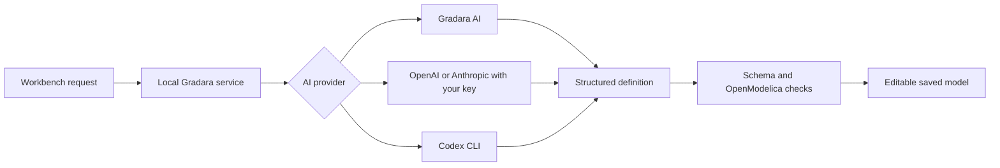

# Enable AI features

AI creates blocks, builds complete models from a description, edits the open model from the Assistant, explains or fixes failed runs, and generates C for controller blocks. Editing, wiring, simulating, and reopening models never need AI or an account.

Choose a provider in **Settings → AI**:

| Provider | Setup | Who bills you |
| --- | --- | --- |
| **Gradara AI** (recommended, default in the desktop app) | Choose **Sign in**, approve the code in your browser with Google or an email link. New accounts include starter credits. | Prepaid credits bought in the app through Stripe |
| **OpenAI API key** | Paste a key; Gradara verifies it with a free request and stores it in your OS keychain. Optionally set a model. | OpenAI, under your account |
| **Anthropic API key** | Same as OpenAI. | Anthropic, under your account |
| **Codex CLI** (developer option) | Install and sign in to the Codex CLI (below). Shown when found. | Your Codex plan |
| **Off** | Turns AI requests off. AI buttons stay visible and report that AI is off. | Nobody |

Gradara AI prices are per operation: a block (2 credits), a full model build (20), a C export (2), an assistant edit (4, plus 2 for each new or rewritten block, at most three), and explaining problems (2). **Fix with AI** costs the explanation plus the edit. Automatic repair attempts are included, and a request, or a block within an edit, that fails before producing output is not charged. The composer and assistant footers show the cost and your balance, and each assistant answer shows what it actually cost.

Generated blocks pass local schema checks, then an OpenModelica compile check, and assistant edits run a trial simulation of the edited model, so the simulation engine must be set up (Settings → Engine). **Explain** alone only reads the problems and never compiles anything. See [privacy](PRIVACY.md) for exactly what is sent and stored.

### Codex CLI (developer option)

Install the public CLI in the environment where the Python service runs:

```sh
npm install -g @openai/codex@0.154.0
codex login
export GRADARA_CODEX_BIN="$(command -v codex)"
.venv/bin/python scripts/start.py
```

Source checkouts default to Codex when the CLI is found and to Gradara AI otherwise. `GRADARA_AI_PROVIDER` overrides the saved choice. The adapter ignores user `config.toml`, filters most `CODEX_*` variables (except `CODEX_HOME`), and keeps prompts and responses under `projects/agent/` for debugging.

## Try your first generated block

1. Start a blank model and open the agent composer.
2. Choose **Signal / control** in **Block type**, then ask: “A first-order low-pass filter with scalar input u, output y, and a 50 ms time constant.”
3. Wait for generation and the OpenModelica check. The successful definition is inserted into the diagram through normal model editing.
4. Connect a Step block to its input, set a suitable stop time, and run the model. Inspect the output in Results.

The generated equations become part of the saved document. Reopening, sharing, and simulating that block do not require another AI call. Asking for a revision or generating C does.

## What runs where


```mermaid
flowchart LR
    UI[Workbench request] --> API[Local Gradara service]
    API --> Choice{AI provider}
    Choice --> GW[Gradara AI]
    Choice --> Vendor[OpenAI or Anthropic with your key]
    Choice --> CLI[Codex CLI]
    GW --> JSON[Structured definition]
    Vendor --> JSON
    CLI --> JSON
    JSON --> Check[Schema and OpenModelica checks]
    Check --> Model[Editable saved model]
```

The agent authors bounded equations. Conventional code packages connectivity, supervises compilation, and executes the simulation. Choose Signal / control, Electrical, Mechanical (rotational), Thermal, or Multiple physical domains before generation. The selected type constrains the provider schema and server validation. Physical blocks have real Modelica terminals, and may also expose scalar signal ports. Refinement preserves the type and existing terminal IDs, domains, and directions. Arbitrary connector families, translational mechanics, whole subsystems, and HDL generation are not implemented. C code for library blocks is generated without an AI provider; the provider only writes C for a custom block that has no template. See the [execution contract](architecture/EXECUTION.md).

Generation sends the prompt and relevant definition to the provider; refinement and repair can include prior candidates and compiler diagnostics. C export includes its controller contract. Editing the open model from the Assistant tab sends the request, the open model without its layout, the names of selected blocks, and the block catalog; its one automatic revision can include the previous plan and run diagnostics. Ordinary simulation does not call a provider. See [privacy](PRIVACY.md) and [security](../SECURITY.md).

## If it does not work

| Symptom | Check |
| --- | --- |
| "Sign in to Gradara AI" | Settings → AI → Sign in, then approve the code in the browser page that opens. |
| "Not enough credits" | Buy credits in Settings → AI. Your balance refreshes when you return from checkout. |
| "rejected the API key" | The saved key is invalid or revoked. Paste a new one. |
| "does not recognize the model" | Clear the model field to use the default, or enter a model your account can use. |
| Rate limit or temporarily unavailable | Wait and retry. Gradara AI does not charge for requests that fail before producing output. |
| Candidate fails compiler checks | Check Settings → Engine. The service allows one compiler-driven repair, then reports the diagnostic. |
| Codex CLI not listed | Check `command -v codex`, set `GRADARA_CODEX_BIN`, and restart the service. |

## Library and model builds

Successful generations are saved automatically in the local **AI blocks** library. Reuse them without another provider call. The library keeps complete definitions; refinements do not silently alter existing model instances.

**Ask agent → Full model / circuit** uses the same provider. With Gradara AI it costs one model-build price, which covers every block it creates. A request may invoke the provider several times: library planning, each missing block (with optional repair), assembly, and one optional assembly repair. It can therefore take several minutes and consume more provider usage than a single block. OpenModelica must be available for both component checks and the final trial simulation. See the [user guide](USER_GUIDE.md#ask-an-agent-for-a-complete-model) for review, cancellation, and saved-model behavior.

**Assistant → edit the open model** uses the same provider. One request plans the edit, generates any new or rewritten blocks (each with its own compile check), applies the operations locally, and runs a trial simulation, with one automatic revision. It returns a proposal you apply or discard; see the [user guide](USER_GUIDE.md#edit-the-open-model-with-the-assistant). **Problems → Explain** asks for a diagnosis only; **Fix with AI** runs the diagnosis and then the same edit pipeline.

The repository's [AGENTS.md](../AGENTS.md) and [task playbooks](agents/PLAYBOOKS.md) are separate instructions for coding agents contributing to Gradara. End users do not need them.
