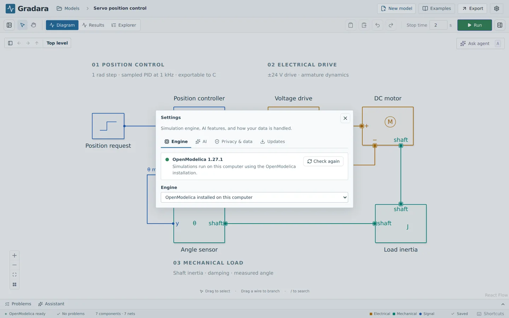
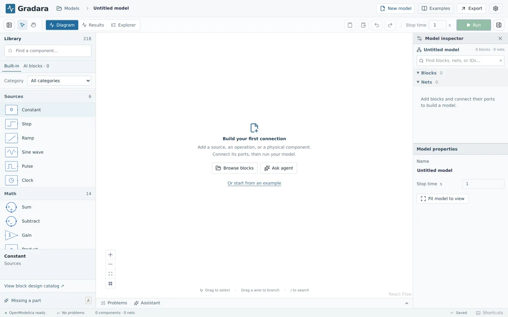

# Install Gradara

Gradara is a desktop app for Windows, macOS, and Linux. You install the app, then set up the simulation engine once. The engine is OpenModelica with the Modelica Standard Library 4.1.0. Gradara does not include it, so the first setup needs an internet connection.

After that, see [Your first 10 minutes](USER_GUIDE.md#your-first-10-minutes).

## Requirements

| | Windows | macOS | Linux |
| --- | --- | --- | --- |
| System | Windows 10 or 11, 64-bit (x64) | macOS 13 Ventura or newer, Apple silicon or Intel | 64-bit (x86-64). Tested on Ubuntu 22.04 and 24.04. |
| Download | `Gradara-win-x64.exe` | `Gradara-mac-arm64.dmg` (Apple silicon) or `Gradara-mac-x64.dmg` (Intel) | `Gradara-linux-amd64.deb` (Debian, Ubuntu) or `Gradara-linux-x86_64.AppImage` (other distributions) |
| Simulation engine | OpenModelica 1.27, installed on your computer | A container runtime (Colima recommended) and the Gradara engine image | OpenModelica 1.27 from its Linux packages (or Docker) |
| Extra disk space for the engine | About 2–3 GB for OpenModelica and its library | 1–2 GB for the engine image, inside a container VM that can grow to 30 GB | About 1–2 GB for OpenModelica and its library |

[Supported platforms](PLATFORMS.md) lists what is tested on each system.

Rough guidance: 8 GB of RAM or more (16 GB is comfortable on macOS, where the engine runs in a small virtual machine), and a few hundred MB for the app itself. Large models and long simulations need more space for results.

You need a network connection to download the app and to set up the engine the first time. After that, drawing and simulating work offline. AI features and update checks need a connection.

## Download

Download from **[gradara.app](https://gradara.app/)** or from the [latest GitHub release](https://github.com/edgaralejod/gradara/releases/latest). Direct links:

- Windows: [Gradara-win-x64.exe](https://github.com/edgaralejod/gradara/releases/latest/download/Gradara-win-x64.exe)
- macOS, Apple silicon (M1 and later): [Gradara-mac-arm64.dmg](https://github.com/edgaralejod/gradara/releases/latest/download/Gradara-mac-arm64.dmg)
- macOS, Intel: [Gradara-mac-x64.dmg](https://github.com/edgaralejod/gradara/releases/latest/download/Gradara-mac-x64.dmg)
- Linux, Debian or Ubuntu: [Gradara-linux-amd64.deb](https://github.com/edgaralejod/gradara/releases/latest/download/Gradara-linux-amd64.deb)
- Linux, other distributions: [Gradara-linux-x86_64.AppImage](https://github.com/edgaralejod/gradara/releases/latest/download/Gradara-linux-x86_64.AppImage)

Not sure which Mac you have? Open the Apple menu → **About This Mac**. "Chip: Apple M…" means Apple silicon. "Processor: Intel" means Intel.

## Install the app

### Windows

1. Run `Gradara-win-x64.exe`.
2. The Windows installer is not code-signed yet, so Windows SmartScreen may show **"Windows protected your PC"**. Choose **More info**, check that the file name is `Gradara-win-x64.exe`, then choose **Run anyway**.
3. Follow the installer. It installs for your user account only. You can change the install folder. It adds a desktop shortcut and a Start menu entry.
4. Open **Gradara** from the Start menu.

Some antivirus tools block the app's local service (`gradara-backend.exe`). If Gradara reports that it could not start its local service, see [Troubleshooting](development/TROUBLESHOOTING.md#the-app-does-not-start).

### macOS

1. Open the `.dmg` file.
2. Drag **Gradara** to the **Applications** folder.
3. Open Gradara from Applications or Launchpad.

The macOS app is signed by Virtu Services LLC and notarized by Apple. On first open, macOS asks you to confirm that you want to open an app downloaded from the internet. Choose **Open**.

### Linux

**Debian or Ubuntu (.deb)**

```sh
sudo apt install ./Gradara-linux-amd64.deb
```

Then open **Gradara** from your applications menu, or run `gradara` in a terminal. The `.deb` does not update itself (see [Updates](#updates)).

**AppImage**

1. Make the file executable: right-click → Properties → Permissions → **Allow executing file as program**, or run `chmod +x Gradara-linux-x86_64.AppImage`.
2. Double-click it, or run `./Gradara-linux-x86_64.AppImage`.

AppImages need FUSE 2. If the AppImage does not start on Ubuntu, install it with `sudo apt install libfuse2` (Ubuntu 22.04) or `sudo apt install libfuse2t64` (Ubuntu 24.04). The AppImage updates itself.

## Set up the simulation engine

Gradara opens **Settings → Engine** for you when the engine is not ready. You can open it any time with the gear button at the top right. The top line shows the status, for example "OpenModelica is not installed" or "OpenModelica 1.27.0". **Check again** refreshes it.

The **Engine** menu at the bottom has three choices:

- **Automatic (recommended)**: uses OpenModelica installed on this computer if it is ready, otherwise the container engine.
- **OpenModelica installed on this computer**: the default path on Windows and Linux.
- **Container engine (Docker)**: the default path on macOS. It also works on Windows and Linux.

Keep **Automatic** unless you have a reason to choose.



### Windows

1. In **Settings → Engine**, choose **Download OpenModelica**. It opens the OpenModelica download page for Windows.
2. Download and run the OpenModelica **1.27** installer for 64-bit Windows. Keep the default options. The download is large (over 1 GB).
3. Return to Gradara and choose **Check again**. The status changes to "Modelica Standard Library 4.1.0 is missing".
4. Under **Install the Modelica Standard Library**, choose **Set up now**. Gradara asks OpenModelica to download the library once. This takes a few minutes.
5. The status shows **OpenModelica 1.27.0** with a green dot. You are ready.

OpenModelica on Windows includes a C compiler. Gradara uses it for **Export → C code → Verify against last run**, so nothing else is needed.

### macOS

OpenModelica does not publish macOS builds. On macOS, Gradara runs OpenModelica inside a small Linux container. You install a container runtime once, and Gradara downloads its engine image.

**Recommended: Colima.** Colima is free and open source. Gradara starts and stops it for you.

1. Install [Homebrew](https://brew.sh) if you do not have it.
2. In Terminal, run:

   ```sh
   brew install colima docker
   ```

3. In Gradara, open **Settings → Engine** and choose **Check again**. The status shows "Docker is not running" with **Start the container runtime**.
4. Choose **Set up now**. Gradara starts a Colima virtual machine named `gradara` (4 CPUs, 4 GB of memory, a disk that can grow to 30 GB), then downloads the OpenModelica engine image (1 to 2 GB). The first time takes several minutes. The button shows progress.
5. The status shows **OpenModelica 1.27.0 (container)** with a green dot. You are ready.

The next time you start your Mac, the Engine tab may say "Docker is not running" again. Choose **Set up now** to start Colima. It does not download the image again.

**OrbStack or Docker Desktop.** If you already run one of them, start it and choose **Check again**; Gradara uses it when there is no Gradara Colima profile, then downloads the engine image with **Set up now**. Gradara cannot start them for you. Note that Docker Desktop's license requires a paid subscription for larger companies, and OrbStack is paid for commercial use. Colima is free.

### Linux

1. Install OpenModelica **1.27** from its Linux packages. Follow the instructions at [openmodelica.org/download/download-linux](https://openmodelica.org/download/download-linux/) (**Settings → Engine → Download OpenModelica** opens that page). You add OpenModelica's package repository, then install the `openmodelica` package with `apt`.
2. Return to Gradara and choose **Check again**. The status changes to "Modelica Standard Library 4.1.0 is missing".
3. Under **Install the Modelica Standard Library**, choose **Set up now**. This takes a few minutes.
4. The status shows **OpenModelica 1.27.0** with a green dot. You are ready.

OpenModelica compiles each model to C, so it needs a C compiler. Its packages normally install `gcc`. If a run or **Verify against last run** reports that no C compiler was found, install one with `sudo apt install build-essential`.

If you prefer containers, install Docker Engine, start it, and choose **Container engine (Docker)** in **Settings → Engine**. **Set up now** then downloads the engine image (1 to 2 GB).

### Other OpenModelica versions

Gradara is validated with OpenModelica 1.27. Other versions may work, but the Engine tab shows a note, and results can differ. If Gradara cannot find OpenModelica, see [Troubleshooting](development/TROUBLESHOOTING.md#the-engine-is-not-ready).

## Updates

Gradara checks for a new version shortly after it starts and every four hours.

- **Windows, macOS, and the Linux AppImage** download the update in the background. A small progress indicator appears in the header. When the update is ready, the header shows **Restart to update**. Your models are already saved, so restarting is safe. If you do not restart, the update installs the next time you quit.
- **Linux .deb** cannot replace itself without your password. The header shows **Update available**, and **Download from gradara.app** opens the download page. Install the new `.deb` the same way as the first one.

**Settings → Updates** shows your version and has **Check for updates**. The **Help → Check for Updates** menu item does the same.

## Where your models are stored

Gradara keeps your models, simulation results, AI block library, and settings in a data folder. **Help → Open Data Folder** opens it.

| System | Data folder | Logs folder |
| --- | --- | --- |
| Windows | `%APPDATA%\Gradara\data` | `%APPDATA%\Gradara\logs` |
| macOS | `~/Library/Application Support/Gradara/data` | `~/Library/Application Support/Gradara/logs` |
| Linux | `~/.config/Gradara/data` | `~/.config/Gradara/logs` |

Inside the data folder, `models` holds your models and `trash` holds models you removed. Back up the whole data folder to keep your models and results. API keys you enter for OpenAI or Anthropic are stored in your system's keychain, not in this folder.

To move a single model to another computer, use **Export → Gradara project** and **Models → Import file** instead of copying folders.

## Uninstall

Uninstalling the app keeps your data folder, so you can reinstall without losing models. Remove the data folder yourself if you want it gone.

### Windows

1. **Settings → Apps → Installed apps → Gradara → Uninstall** (or **Add or remove programs**).
2. Optional: delete `%APPDATA%\Gradara` to remove your models, results, and settings.
3. Optional: uninstall OpenModelica from **Installed apps**. Its downloaded libraries are in `%APPDATA%\.openmodelica`.

### macOS

1. Quit Gradara and drag it from **Applications** to the Trash.
2. Optional: delete `~/Library/Application Support/Gradara` to remove your models, results, and settings.
3. Optional: remove the engine. In Terminal:

   ```sh
   colima delete --profile gradara
   ```

   This deletes Gradara's Colima virtual machine and the engine image inside it. Then `brew uninstall colima docker` if you no longer need them. If you used another container runtime, remove the `gradara-engine` and `ghcr.io/edgaralejod/gradara-engine` images there.

### Linux

1. `.deb`: run `sudo apt remove gradara`. AppImage: delete the `.AppImage` file.
2. Optional: delete `~/.config/Gradara` to remove your models, results, and settings.
3. Optional: remove OpenModelica with `sudo apt remove openmodelica` (and its repository entry), and its downloaded libraries in `~/.openmodelica`. If you used Docker, remove the images with `docker image rm gradara-engine:1.27.0 ghcr.io/edgaralejod/gradara-engine:1.27.0`.

## Next steps

A new model opens with the block library on the left, the sheet in the middle, and the inspector on the right.



- [Your first 10 minutes](USER_GUIDE.md#your-first-10-minutes)
- [User guide](USER_GUIDE.md)
- [AI features](AGENT_SETUP.md) (optional)
- [FAQ](FAQ.md) and [Troubleshooting](development/TROUBLESHOOTING.md)
- Building from source instead? See the [developer setup](development/SETUP.md).
