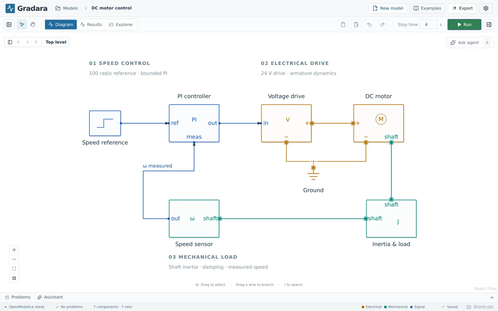
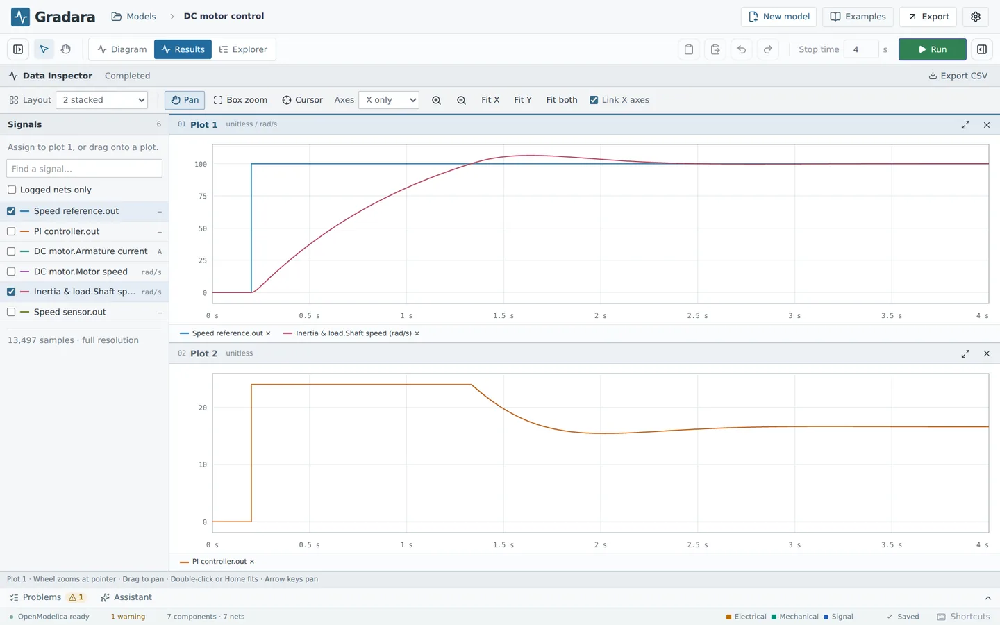
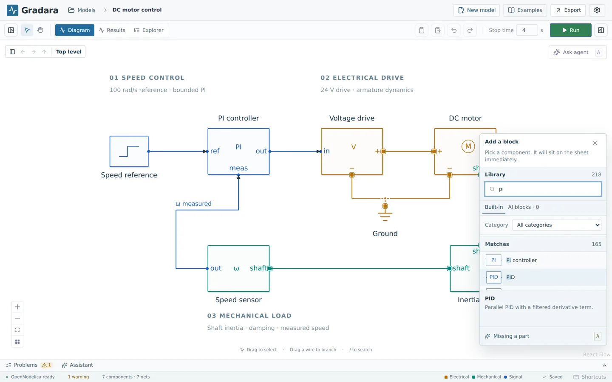
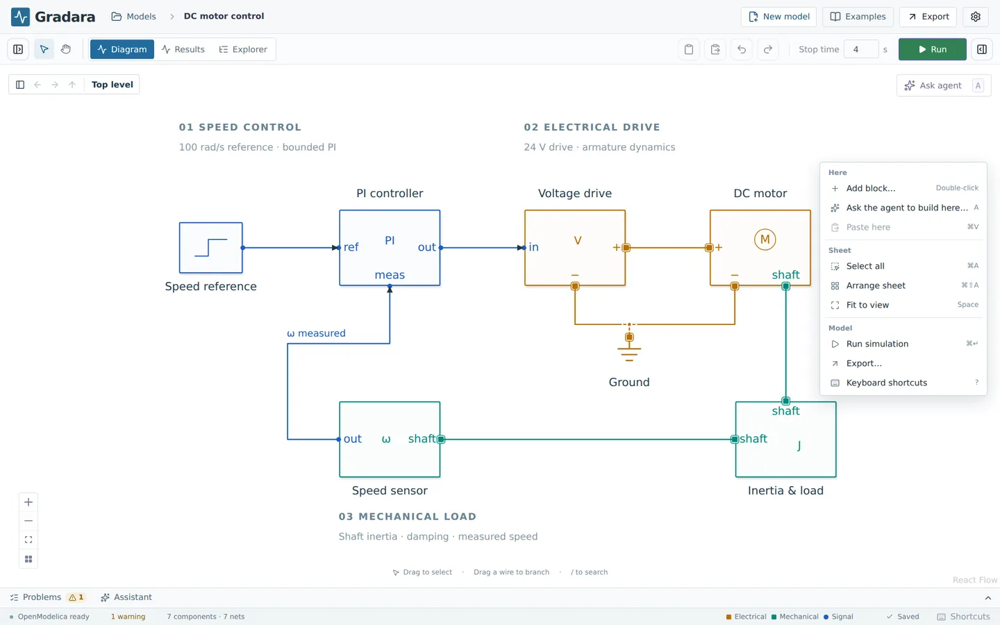
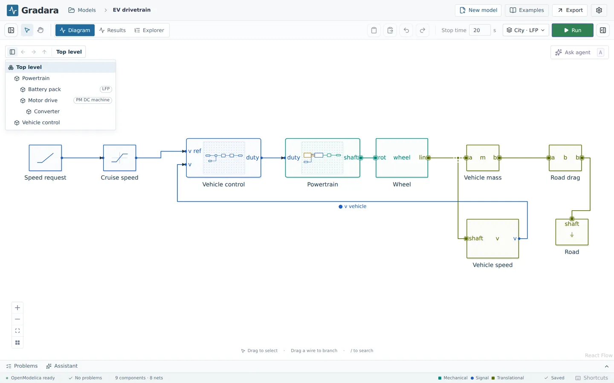
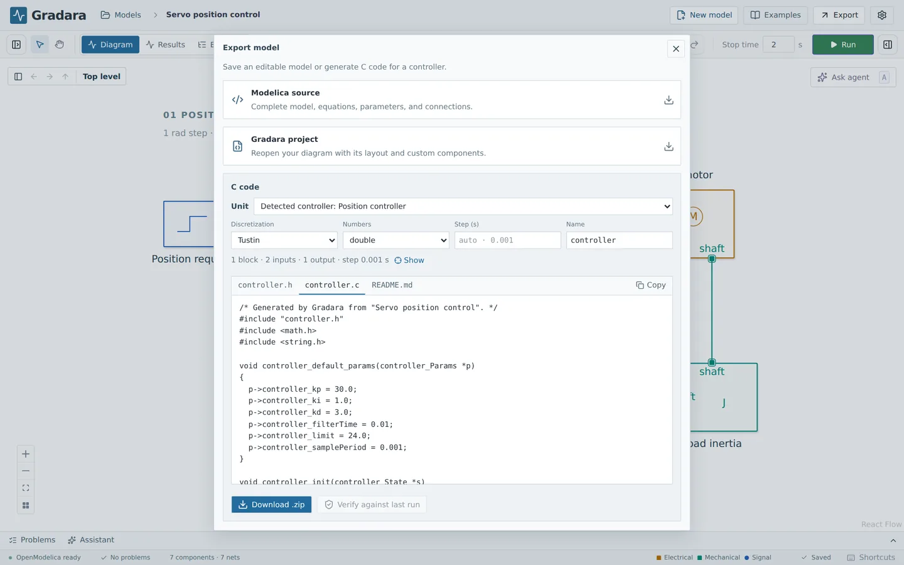

# Gradara user guide

This guide covers the desktop app. To install it, see [Install Gradara](INSTALL.md); the simulation engine comes with the app.

## Your first 10 minutes

The engine is built in, so there is nothing to set up. **Settings → Engine** shows its status with a green dot; if it reports a problem, see [The simulation engine](INSTALL.md#the-simulation-engine).

### Run an example

1. Choose **Examples** in the header. Under **DC motor**, choose **Use example**. Gradara saves your own copy in **My models**. The original example does not change.
2. Choose **Run** at the top right, or press **⌘/Ctrl+Enter**. The first run takes a little longer: OpenModelica compiles the model, and on macOS the built-in engine starts first (a few seconds).
3. When the run finishes, Gradara switches to the **Results** tab. The plot compares the speed request with the measured motor speed.
4. Go back to the diagram with the **Diagram** tab or **⌘/Ctrl+1**.
5. Double-click the **Speed reference** block. Change **Target speed** from 100 to 60, then choose **Apply**.
6. Run again. Results now shows the motor settling at 60 rad/s.

### Build a model from a blank sheet

1. Choose **New model**. An empty sheet named **Untitled model** opens. Click the name in the header to rename it.
2. Double-click empty canvas. A block picker opens at the pointer. Type `step` and choose **Step**.

   

3. Double-click to the right of it, type `second` and choose **Second-order**. This is a second-order transfer function, ωn² / (s² + 2ζωn s + ωn²).
4. Drag from the Step's output port (right side) to the Second-order's input port.
5. Set **Stop time** next to **Run** to 2 seconds, then choose **Run**.
6. In **Results**, check the Second-order output in the signal list. You see a step response that overshoots slightly and settles at 1. Results lists every block output, so you never need a block just to see a signal.
7. Double-click the Second-order block and lower **Damping ratio** to 0.2. Run again and compare.

You can also use the block library on the left. It opens with a new blank model; the first button in the toolbar (**Show components** / **Hide components**) toggles it. Press **/** to search it, then click or drag a block onto the sheet. A search looks through every category, whatever the category menu shows: blocks whose name or description contains what you typed come first as **Matches**, and blocks that only share scattered letters with it are listed apart as **Approximate matches**.

Next, read [Build a diagram](#build-a-diagram) and [Simulate and read results](#simulate-and-read-results), or open other examples from [Built-in examples](#built-in-examples).

## Keyboard shortcuts

Press **?** on the canvas to see this list in the app. On Windows and Linux, use Ctrl where macOS uses ⌘.

| Action | Keys or gesture |
| --- | --- |
| Search the library | / |
| Add a block at the pointer | Double-click empty canvas |
| Open a block's properties | Double-click the block |
| Open a subsystem | Double-click it |
| Ask AI (edit, new block, model, or about the results on show) | A |
| In the Ask bar: send / new line / next action / close | Enter / Shift + Enter / Tab / Escape |
| Run simulation | ⌘/Ctrl + Enter |
| Save now (edits also save automatically) | ⌘/Ctrl + S |
| Undo / redo | ⌘/Ctrl + Z / ⌘/Ctrl + Shift + Z |
| Select all blocks and wires | ⌘/Ctrl + A |
| Copy / cut / paste | ⌘/Ctrl + C / X / V |
| Duplicate selection | ⌘/Ctrl + D |
| Drag a copy of a block or selection | Ctrl + drag |
| Delete selection | Delete / Backspace |
| Select several items | Shift + click, or drag a box on empty canvas |
| Nudge selected blocks or wires | Arrow keys, one grid step (Shift + arrows for five) |
| Show or hide the grid | ⌘/Ctrl + ' |
| Drag without alignment snapping | Hold Alt (Option) while dragging |
| Rotate selected blocks clockwise | R |
| Open the selected block's reference page | F1 |
| Draw a connection | Drag from port to port, or click two ports |
| Branch from a wire | Alt + drag |
| Move a wire segment | Select the wire, then drag |
| Reconnect a wire | Drag its round end |
| Redraw a wire | Select it, press D |
| Finish redrawing | Click the destination, or Enter |
| Remove the last bend / cancel drawing | Backspace / Escape |
| Restore automatic routing (wires selected) | R |
| Name a signal or net | Double-click the wire, or select it and press F2 |
| Move a signal label | Drag it along its net |
| Resize a block | Drag a corner or edge |
| Move a block name / reset its position | Drag the name / double-click it |
| Select / pan tool | V / H |
| Pan the canvas | Space + drag, middle or right mouse button, or trackpad |
| Fit the model to the view | Tap Space, or F |
| Arrange the sheet (or the selection) | ⌘/Ctrl + Shift + A |
| Canvas menu | Right-click empty canvas or a block |
| Make subsystem / ungroup | ⌘/Ctrl + G / ⌘/Ctrl + Shift + G |
| Leave a subsystem | Escape (nothing selected), or ⌘/Ctrl + ↑ |
| Diagram / Results / Explorer tab | ⌘/Ctrl + 1 / 2 / 3 |
| Search the model | ⌘/Ctrl + K |
| Show or hide the Problems dock | ⌘/Ctrl + J |
| Show the shortcut list | ? |

Shortcuts do not fire while you type in a text field or an equation editor.

## Settings

The gear button at the top right opens **Settings**. It has five tabs:

- **Engine** shows whether the built-in engine is ready, can restart it, and lets you choose your own OpenModelica installation or Docker instead. See [The simulation engine](INSTALL.md#the-simulation-engine).
- **AI** chooses the provider for AI features: Gradara AI (sign in and use prepaid credits), your own OpenAI or Anthropic API key, or **Off**. When you are signed in, it shows your credit balance, prices, and credit packs. See [AI features](AGENT_SETUP.md).
- **Personal features** (installed app only) asks the workshop for features built just for you and installs them. See [Personal features](#personal-features).
- **Privacy & data** summarizes what stays on your computer and what AI requests send. See [privacy](PRIVACY.md).
- **Updates** shows your installed version and has **Check for updates**. See [Updates](INSTALL.md#updates).

## Models, saving, and sharing

**New model** opens an empty sheet named **Untitled model** (with a number added when that name is taken). Click the name in the header to rename it. Enter or clicking away keeps the new name. Escape cancels.

**Models** opens the model browser:

- **My models** lists your saved models, newest first, with a search box. Each row shows the block count and, for copies of examples, which example it came from.
- **Examples** lists the complete example systems (motor drives, converters, the EV, data-center cooling), and **Block examples** the small model for each library block, grouped by area. Select one to preview its diagram and description; search block examples by any block they use. **Use example** (or double-click, or Enter) saves a new copy in My models. Changing the copy never changes the example.
- **Trash** holds models you removed. Use the trash icon on a row to remove a model (open a different model first if it is the one you are editing). Click a model in Trash to restore it. Trash is never emptied automatically.

**Save a copy** saves your current edits as a separate model. **Import file** opens a `.gradara.json` file as a new model, even if a model with the same identity already exists; a file that is not a Gradara model is reported in the browser, with the reason, and nothing is added. Copies and imports always get a distinct name. **Export** downloads a Gradara project file (`.gradara.json`), Modelica source, or C code. Gradara cannot import Modelica files.

### Saving

Gradara saves your edits automatically after a short pause. Switching models or opening the model browser finishes the save first. **⌘/Ctrl+S** saves right away. The footer shows **Unsaved changes**, **Saving**, **Saved**, or **Not saved**.

If you reload the window (**View → Reload**) before a save finishes, Gradara recovers your unsaved edits and says so. This only works while the app stays open; it is a safety net, not a backup. Undo history is kept per model and clears when you switch models or reload.

If the same model is saved from somewhere else in the meantime (for example a second browser window when running Gradara from source), Gradara refuses to overwrite it. The error banner offers **Retry**, **Save a copy**, and **Reload saved version**. **Save a copy** keeps your edits. **Reload saved version** replaces them with the saved version. Gradara does not merge edits.

### Where files are stored

Models, results, and settings live in your data folder. **Help → Open Data Folder** opens it. Models are in its `models` folder and removed models in `trash`. The [install guide](INSTALL.md#where-your-models-are-stored) lists the location on each system. Back up the whole data folder to keep your models and results. Folders inside My models are not supported yet.

## Build a diagram

Add blocks from the library: click a block to place it, or drag it onto the sheet. Double-click empty canvas to open the block picker at the pointer. If the library lacks a part, ask AI for one: press **A**, choose **Ask AI for a block here…** in the canvas menu, or **Missing a part** in the library or the block picker (see [AI features](#ai-features)).

Select a block to edit its parameters in the inspector on the right. Double-click a block to open its properties dialog. There you can rename it and change every parameter, for example a gain's `k` or a resistor's `R`. **Reset** restores a built-in block's default value. Changes apply when you choose **Apply** or press Enter, as one undo step. **Cancel** or Escape discards them. The dialog only shows sections a block has.

The **Equations** and **State & declarations** tabs show a block's Modelica equations. You can edit them for signal blocks and AI-generated blocks. Built-in physical blocks use Modelica Standard Library components, so their tab names the library class and is read-only. The inspector's **Edit…** and **Equations → Open** open the same dialog.

**Block reference.** Every block has a reference page, like a Simulink block's Help: what it does, its ports and parameters with defaults and units, the equations it solves, the Modelica class behind it, and what it leaves out. Select a block and press **F1**, or choose **Help** from the canvas menu, the **?** next to Component properties in the inspector, or the **Help** button in the block's properties dialog. In the library, **Block reference** under a part's description opens its page before you place it. The pages work offline, and the same pages are at [gradara.app/docs/blocks](https://gradara.app/docs/blocks/). A custom block the AI wrote shows its own ports, parameters, and equations.

**Notes.** Label parts of a diagram with notes: a heading and an optional detail line. Right-click empty canvas and choose **Add note here**, type the heading, press Tab for the detail, and press Enter. Drag a note to move it; it lands on the sheet grid. Double-click a note to edit it, or select it and press Delete to remove it. Every change can be undone. Notes belong to the top-level sheet; the notes in the built-in examples work the same way.

**Block examples.** Every library block has a small runnable example that shows it at work, such as an RC circuit for the capacitor or a clutch that locks for the clutch. In a block's Help, choose **Open example**: the example opens as a new model in **My models**, with that block selected, ready to run. Each example's description says what to look for in Results. The model browser lists them all under **Block examples**, grouped by area and searchable by block name, and each block's page on gradara.app shows its example's diagram.

**Scope, Display, and Terminator** are no longer in the library: Results already lists every block output, and an unconnected output is allowed. Models that contain them still open and run unchanged. To show that an output is unused on purpose, right-click its block and choose **Terminate unused outputs**: each open output gets a terminator mark, as in Simulink, with no block and no effect on the simulation. Wiring the output removes its mark; **Remove terminators** removes them all.

Blocks get unique names such as Step, Step1, and Step2. Renaming a block does not break its connections. Drag a block's name to move it; select it and press Home to put it back. Double-click a block's name (or select it and press Enter) to rename the block in place, subsystems included: Enter or clicking away saves, Escape cancels. Press **R** to rotate selected blocks 90° clockwise. Drag a selection handle to resize a block in 16-unit steps, type a width or height in the inspector, or choose **Use standard size**.

### The library

The library has 217 built-in blocks in 18 categories: Sources, Math, Continuous, Discrete, Nonlinear, Routing, Ports & subsystems, Control, Logic, Electrical, Semiconductors, Converters, Machines, 3-phase, Rotational, Translational, Thermal, and Magnetic. Most physical, logic, and machine blocks are components of the Modelica Standard Library 4.1.0. Their parameters map directly onto the library component. In a source checkout, a visual catalog of every block is at `/block-catalog` in the workbench.

### Ports and connections

Port colors show what a port carries: signal (real numbers), Boolean, electrical, rotational, translational, thermal, magnetic, or 3-phase. A block can have ports of more than one kind. For example, a speed sensor has a rotational terminal and a signal output.

There are two kinds of connection:

- **Signal connections** go from an output to one or more inputs. Values flow one way, like a block diagram.
- **Physical connections** join physical terminals of the same kind, like wiring a circuit or coupling shafts. They have no direction. The solver works out currents, torques, forces, or heat flows from the laws of physics.

To move between the two, use sensors (physical to signal) and sources or actuators (signal to physical). Wires that only cross do not connect.

### Signal buses

A bus carries several signals on one wire, drawn heavy so it stands out. Four blocks in **Routing** make and take them apart, as in Simulink:

- **Mux** joins its inputs into one vector, in order. **Demux** splits a vector back into equal parts. Set how many inputs or outputs under **Signals** in the block's properties (in the inspector, or in the dialog a double-click opens); the bar grows to fit, and **Match incoming** gives a Demux one output per signal.
- **Bus Creator** bundles signals under names: each input label is the signal's name, edited under **Signals**. A bus plugged into a Bus Creator keeps its signals under that input's name, such as `motor.speed`.
- **Bus Selector** picks signals out of a bus by name, wherever they are in it. Tick them under **Signals**; each becomes an output labeled with its name. Ticking a bus inside the bus (`motor`) gives all its signals as one vector.

Buses pass through subsystem ports unchanged, so one wire can carry a group of signals into and out of a subsystem. Widths follow the wiring automatically. Other blocks take one signal: a bus wired into a Gain or Sum is reported as a problem that says to split it first. Results show one trace per signal of a bus, named after its element (for example `Sensors.bus.speed`), and logging a bus wire logs every signal on it. The **Mux and Demux** and **Signal buses** examples show both kinds.

## Wire and arrange

| Action | Gesture |
| --- | --- |
| Connect | Drag from port to port, or click the start and then the destination. |
| Join an existing net | Finish on a wire or a junction. |
| Place bends while drawing | Release in empty space, then click where each bend goes. |
| Reshape | Select a wire and drag a segment, a midpoint grip, or a corner. |
| Reconnect | Drag a selected wire's round end to another port or wire. |
| Redraw | Select a wire and press D; finish at the highlighted destination or press Enter. |
| Restore automatic routing | Select the wire and press R. |
| Branch | Drag an unselected wire, Alt-drag a wire, or drag from a junction. |
| Cancel / remove the last bend | Escape / Backspace while drawing. |
| Move a selection | Drag one of its blocks. |
| Duplicate | Ctrl-drag, or ⌘/Ctrl+D. |

Use the **arrow keys** to nudge selected blocks, wires, or junctions by one grid step, or **Shift + arrow** for five. Holding an arrow key moves the selection as one undo step.

**The grid.** Blocks, ports, and bends sit on an 8-unit grid, and block sizes change in 16-unit steps, so any two ports can be lined up exactly and a straight wire between them is truly straight, whatever you resized or rotated. Dragging a block snaps it to the grid, and to the line of a wire it connects to when a port comes within a couple of steps of it. It also proposes alignments with the other blocks: when its edges or center come close to lining up with another block's, it snaps into line and a dashed pink guide shows the shared line. Drag a little further to ignore the guide, or hold **Alt** (Option on a Mac) while dragging to turn off all snapping except the grid. Resizing keeps the edge you are not dragging in place. To see the grid, press ⌘/Ctrl + ' or choose **Show grid** from the canvas menu; it is a view setting and stays on in this browser until you turn it off. Models saved by an earlier version are moved onto the grid when they open: a block moves by at most a few units, and a wire that ends up a step out of line is straightened.

Wires route around blocks, stay clear of other wires and block names, and never loop back on themselves. A wire you shaped by hand keeps its shape while it still makes sense. When you move a block, the wire section next to it follows. If the shape would then loop or cross a block, the wire goes back to automatic routing. When you move a group selected with a box, wires that only touch the box stretch to the blocks that stay.

**Arrange** (⌘/Ctrl+Shift+A, or the grid button in the canvas controls) redraws the whole sheet, or only the selected blocks when two or more are selected. It is one undo step. Signals flow left to right. Feedback and measurement paths run underneath. Parallel circuit branches sit side by side. Grounds sit under their terminal. Wires are lined up so they run straight. Arrange keeps your rough order where the model does not decide. If the drawing is already as clean as Arrange can make it, a message says so. Notes move to a band above the drawing.

**Fit to view**: tap **Space** or **F**, or use the fit button in the canvas controls. Fit shows everything on the sheet and keeps it clear of the canvas buttons. Holding Space and dragging pans instead. A fitted view stays fitted when you open or close panels or resize the window.

**Canvas menu**: right-click empty canvas, or a block (which selects it unless it is already part of the selection). With a selection, it starts with commands for the selection (cut, copy, duplicate, rotate, terminate unused outputs, help, make or ungroup a subsystem, arrange, delete). Then come commands for the spot you clicked (add a block, **Ask AI for a block here…**, paste), for the sheet (select all, arrange, fit, show or hide the grid, reset layout, leave a subsystem), and for the model (run, export, keyboard shortcuts). Arrow keys move through the menu, Enter runs a command, and Escape closes it. Inside a subsystem it also has **Add input port here** and **Add output port here**.

**Panels.** Almost every pane has a draggable border. Drag the inner edge of the component library or the inspector to resize it, and the top edge of the Problems dock (up to 70% of the window) to change its height. Inside the library, drag the border above the part description; inside the inspector, drag the border between the model tree and the properties. In Results, drag the edge of the Runs and Signals list, the border between **Runs** and **Signals**, and the borders between plots; in **Compare runs**, drag the edge of the signal table and the border between the overlaid and difference plots. Drag the corner of the Ask bar's text box to make it taller. Windows such as Block properties, Block reference, Settings, Examples, Export, and Keyboard shortcuts can be resized by any edge or corner (they stay centred, so the opposite edge moves too); double-click a corner to restore a window's own size. Sizes are remembered in this browser, and arrow keys move a focused border (Shift for bigger steps). Double-click a border to restore that pane, or choose **Reset layout** from the canvas menu (or **View → Reset Layout** in the desktop app) to restore every panel, column width, plot split, dialog size, and the dock at once.

**Inspector**: the right-hand panel shows the model as a tree of blocks and nets. Select the model, a block, or a net to see its properties. A net is one electrical node or signal, however many wire pieces draw it. Each net gets an automatic name. Give it your own name when that is clearer. Net names appear on the diagram only once you name them; **Show name on diagram** in the net's properties turns this on or off.

If a wiring gesture behaves unexpectedly, report it with a small example (see [Troubleshooting](development/TROUBLESHOOTING.md#report-a-bug)).

## Subsystems

A subsystem is a block with its own diagram inside. Use subsystems to group parts of a large model.

- **Add one.** The **Ports & subsystems** library has **Subsystem** (one input wired to one output inside) and **Empty subsystem** (nothing inside, no ports). It also has **Subsystem input** and **Subsystem output** for use inside a subsystem. You can also double-click the canvas and type "subsystem".
- **Make one from existing blocks.** Select blocks and press ⌘/Ctrl+G. You can also choose **Create subsystem** from the **…** button at the corner of a selection of two or more blocks, or **Make subsystem** in the inspector or the canvas menu. Every wire that crossed the selection edge becomes a port: a signal driven inside becomes an output, one driven outside becomes an input, and a physical connection becomes a physical terminal. Connections and net names outside stay the same.
- **Open it and move around.** Double-click the block, or choose **Open** in the inspector. The bar at the top left of the canvas has back, forward, and up buttons and the path from **Top level** to where you are. Click a level to go there. Its first button shows every subsystem as a tree, with the active variant of each. Press Escape with nothing selected, or ⌘/Ctrl+↑, to go up one level. Every tool works inside, and each edit is one undo step.
- **Ports.** Each port is an **input** or an **output**, and its **type** says what it carries: signal, Boolean, or a physical domain. For a physical port, input or output only decides which side of the block it starts on. Inputs and outputs are numbered from 1. A new port takes the type of the first wire you connect to it. Changing a port's direction or type later removes its wires.
- **Add ports from outside.** Drop a wire on the body of a subsystem block. A wire from an output makes an input, one from an input makes an output, and one from a physical terminal makes a terminal of that kind. Select the block to list its ports in the inspector. There you can rename, retype, move, renumber, remove, or add ports.
- **Ports inside.** Inside, ports are colored pills named after the port. Right-click empty space and choose **Add input port here** or **Add output port here**, or drop **Subsystem input** or **Subsystem output** from the library. Double-click a pill to edit it. Adding, removing, or renaming a port updates every copy of the subsystem. Wires to a removed port are removed.
- **Ungroup.** Press ⌘/Ctrl+Shift+G, or choose **Ungroup** in the inspector. The contents replace the block and keep their connections.
- **Shared contents.** Copying or duplicating a subsystem block makes another instance with the same contents. The inspector shows **Used N×** when several instances share them. Editing the inside changes all of them. **Make unique** gives the selected instance its own copy.
- **Parameters.** Inside a subsystem, the ↑ button beside a parameter promotes it to the subsystem block, so each instance can set its own value. The inner field then shows **set per instance**. The ↓ button undoes this.

Results from inside a subsystem are named by path, such as `Drive › Gain.y`. The Results signal list groups them under **Top level** and each subsystem.

A subsystem block shows a small live drawing of its contents. Hover over it for a larger preview.

### Variants and configurations

A variant is one of several alternative contents for the same subsystem, behind the same ports. For example, two controller designs, or two battery chemistries.

Select the subsystem block and use the inspector's **Variants** section:

- **+ Diagram variant** copies the current contents into a new variant you can edit on its own.
- **+ Parameter variant** keeps the same contents with its own values of the promoted parameters.

New variants are named A, B, C. Double-click a name to rename it. A switch above the block shows every variant and changes the active one with one click. Removing all but one variant makes the block an ordinary subsystem again.

Only the active variant is simulated. The block has every port any variant has. If the active variant lacks one of them, the Problems dock reports an error and **Run** refuses the model, unless you mark that port **not used here** for that variant. An unused port does nothing: an output gives 0 (or false), an input is ignored, and a physical terminal carries no current, torque, force, heat, or flux. Problems in inactive variants appear as warnings. When the engine is ready, Gradara also compiles each inactive variant in the background a few seconds after you stop editing, one at a time and never during a run. A variant that does not compile appears under **Inactive variants** in Problems. You can turn this off, or compile now, in the Explorer's **Variants** view.

A configuration is a saved set of variant choices for the whole model. When a model has variants, a configuration menu appears left of **Run**. It shows the saved configuration that matches the current choices, or **Custom**. **Save current choices…** stores which variant every subsystem uses. Choosing a configuration switches all of them in one undo step. **Run all configurations** (with two or more saved) runs each one without changing the open model, then opens Results with every signal overlaid and named `[Configuration] signal`. The overlay is not saved with the model; run again to see it after reopening.

## Model Explorer

The **Explorer** tab (⌘/Ctrl+3) shows the whole model at once, next to the Diagram and Results tabs.

- **Tree.** Lists the blocks of the top level. Subsystems expand to their contents, and subsystems with variants expand to their variants. Badges show the active variant and **Used N×**. A red dot marks a block with problems. Double-click a row to open that place in the Diagram.
- **Parameters.** Every parameter under the selected tree item (the whole model when the top is selected) in one table: location, block, parameter, value, unit, and range. Edit values in place; each edit is one undo step. **Filter** matches block, parameter, and unit names. **Find value** and **Replace with** change every listed parameter with a given value. ↑ promotes a parameter inside a subsystem.
- **Variants.** One row per subsystem with variants, one column per configuration. **Current** switches the active variant. Each configuration column sets that configuration's choice, and **Apply** switches the model to it. **Configuration from current choices** adds one. **Run all configurations** runs and overlays them.
- **Signals.** Every signal net with its location and unit. Check **Log** to record it on the next run. After a run, each logged signal's range is shown. **Open Results** switches to Results.
- **Search.** ⌘/Ctrl+K opens the Explorer and puts the cursor in search. It finds blocks, ports, parameters, nets, subsystems, and variants anywhere in the model. Enter or a click opens the match in the Diagram.

Drag the borders between panes to widen them, and drag a column heading's edge to resize it (double-click to fit). The tables stay fast even for a thousand blocks.

## Simulate and read results

Set **Stop time** and choose **Run**. The stop time must be more than 0 and at most 86,400 seconds (one day). You can cancel a run from the same button. Gradara checks the model before it simulates.

While a run is going, a progress card floats at the bottom of the diagram (and fills the empty Results view if you are there). It shows the step the run is on (**Translate**, **Compile**, **Simulate**, **Results**), a bar that fills with simulated time once the simulation starts, how much model time has been simulated ("84.8 ms of 300 ms"), the time elapsed, and an estimate of the time left once there is enough to go on. The Stop button fills as the run advances, and the status bar says the same in words. Translating and compiling take a few seconds whatever the stop time; the bar moves only while simulating. **Run all configurations** shows which configuration is running. Unconnected signal inputs, bus mistakes, the empty subsystem placeholder, and missing variant ports are reported as problems. A failed or incomplete simulation never shows as a successful plot.

Each run saves 6,000 evenly spaced output points plus every event, unless the model's simulation settings say otherwise, and stops if it takes longer than 120 seconds of real time or if its results pass 1 GB.

### Simulation settings

With nothing selected, the inspector shows **Simulation** under **Stop time**: the solver and its settings for this model. The defaults (DASSL, tolerance 1e-6, 6,000 output intervals) suit most models, so change them only when something looks wrong.

- **Solver.** Two variable-step solvers, **DASSL** (the default) and **Implicit Runge-Kutta**, choose each step to meet the tolerance. Two fixed-step solvers, **Backward Euler** and **Runge-Kutta 4**, use one step throughout.
- **Tolerance**, **Maximum step**, and **Output interval** apply to the variable-step solvers; **Step size** to the fixed-step ones. Leave a seconds field blank for the automatic value, shown in grey.
- Each field has a one-line explanation under it, and its **?** button explains more. The line at the bottom says what the values mean for the run, such as "Records 6,001 points, one every 667 µs, plus events", and warns when a run would be slow, coarse, or too large to start.
- The **?** next to **Simulation** opens the full guide, also in [Simulation settings](SOLVER.md). It starts with a table of symptoms (a jagged curve, a missed pulse, a slow run, a run that stops early) and what to change for each.
- **Defaults** restores the default settings. Every change is one undo step and marks the last result as out of date.

Settings are saved with the model and recorded with every run. The Runs list shows a run's settings when they are not the defaults, and comparing two runs lists a settings change alongside parameter changes. A failed run whose cause the settings can fix, such as a timeout or a fixed step that is too large, has a **Simulation settings** chip in Problems that opens the guide at the matching symptom.

After a successful run, Gradara switches to the **Results** tab. The panel inside it is titled **Data Inspector**; this guide calls it Results. Use the **Diagram** and **Results** tabs, or ⌘/Ctrl+1 and ⌘/Ctrl+2, to switch.

### Results

Tick signals under **Signals** to draw them on the selected plot, or drag a signal onto any plot. **Export CSV** downloads every output row, one column per signal named as in the list with its unit (`Speed sensor.out [rad/s]`), as `<model name>-<run>.csv`; its first line, starting with `#`, records the model, its revision, the engine, the simulated duration and the run. The on-screen plot is thinned out to stay responsive.

- **Runs.** Gradara keeps every successful run on this computer, so the **Runs** list at the top of the signal pane is the same after you restart it. The newest run is first and is shown by default. Tick up to three runs to show them together on the same plots. Each shown run has its own colour, set with the colour box beside it (the colour is remembered on this computer), and its own list of all its signals under **Signals**. Tick a signal once and it is drawn for every shown run that has it; untick it under one run to hide it only there. With several runs shown, colour tells the runs apart and the line style (solid, dashed, dotted) tells the signals in a plot apart, and the legend names both. A run's heading says how many parameters differ from the first shown run; hover it for the list, such as `Speed reference · Final value: 100 → 60`. The pencil names a run, the arrow exports it as CSV, and the bin deletes it from the disk after a second click on **Delete**. The latest run cannot be deleted while it is shown. **Run all configurations** shows its own overlay and does not use the list. If you untick every run, the plots give way to a short message and a **Show the latest run** button, and the Runs list stays so you can tick any run again.
- **Compare runs.** With two or three runs shown, **Compare runs** in the heading compares them signal by signal, in place of the plots; choose it again to go back. The **Baseline** list picks which shown run the others are compared with; it starts with the oldest.
  - The line under the lists says how many signals differ and, for each other run, what changed from the baseline, such as `Speed reference · Final value: 100 → 60`. If a run's stop time differs, only the shared time is compared.
  - The table lists every signal with one column per compared run holding its largest difference: signals that differ first, largest difference first. Signals are matched by block and port, so a renamed block still lines up. A signal that is not in every run is listed at the end. **Differences only** hides the rest.
  - Click a signal to see all runs, each in its colour, on the upper plot and each run's difference from the baseline on the lower one. Pan, Box zoom, Cursor, and **Fit** work on the time axis of both plots together; the value axis fits what is in view.
  - **Tolerance** decides what counts as a difference. With all three fields empty, any difference counts. **Absolute** is in the signal's own unit and **Relative** is a percentage of the baseline value; the larger of the two applies. **Time** is how far an edge may shift before it counts, which keeps a switching edge that moved by a few microseconds from showing as a full-scale difference. The lower plot draws the allowed band and shades each stretch outside it, and the arrows in its header step through those stretches. Tolerances are remembered on this computer for each model.
  - The two runs are compared at every sample time of either run, by linear interpolation between samples. The tolerance band is defined as in the Simulink Data Inspector.
- **Layouts.** One plot, two stacked, two side by side, a 2×2 grid, or a 3×2 grid. Drag the line between plots to give one more room; each layout remembers its own split. Select a plot by its header, then check signals in the left panel, or drag a signal onto any plot. Removing a signal only changes the view.
- **Navigate.** Use **Pan**, **Box zoom**, or **Cursor**, on **X only**, **Y only**, or **X + Y**. The mouse wheel zooms around the pointer. Link the X axes to keep plots in step. **Fit X**, **Fit Y**, and **Fit both** reset the view; double-click or Home fits both. Arrow keys pan a focused plot. Maximize a plot to see it alone.
- **Cursor values** show the stored sample at or just before the cursor time, so jumps at events stay sharp.
- **Units.** Signals with different units on one plot share one axis. Use separate plots when their scales differ.
- **Summary.** **Summary** in the toolbar opens the **Run summary** under the plots: for each plotted signal of each shown run, its minimum, maximum, mean, final value, steady value and ripple, when it settles, and its overshoot, plus events such as an unsettled signal, a step, switching, or a clipped stretch. With several runs shown it lists the differences from the baseline run, the parameters that differ, and the solver warnings of the first run. Gradara computes it on this computer from the full stored runs, over the zoomed time window when you have zoomed in. Click a time to show it on the plot. No AI is involved.
- **Ask about this run.** Opens the Ask bar on **Explain results** for the shown runs and plotted signals. See [Explain results](#explain-results).

Plot layouts and axis ranges are remembered on this computer for each model. They are not part of the model file.

### Log a signal

Gradara records every block output. To record a particular wire, select it and choose **Log signal** in the wire toolbar, or check **Log to Data Inspector** in its net properties. A dot beside the net name shows it is logged. Run again to capture it. **Logged nets only** in Results filters the list. Only signal wires can be logged. An AI edit can also propose logging a signal. To see a physical quantity such as a voltage or a speed, add a sensor and log its output.

### When results go stale

Moving blocks or names does not change results. Changing equations, connections, parameters, or the stop time does. Run again after such a change. Results you see always belong to the model as it was when it ran.

### Problems

The **Problems** tab sits in the dock under the canvas. Open or close it from the status bar ("No problems", or a count of errors and warnings), from its header, or with ⌘/Ctrl+J. Drag its top edge to resize it.

- **Model checks** update while you edit: unconnected signal inputs, bus mistakes (a bus into a block that takes one signal, a Demux that cannot split its input evenly, a Bus Selector naming a signal the bus lacks), drawing-only blocks, and wires that end on a missing port (errors), and blocks with nothing connected (notes). They also include variant problems anywhere in the model. **Run** refuses the model while errors remain.
- **Last run** appears when a run fails. The dock opens by itself. Each row names where the problem came from (Validation, Safety, Compiler, Runtime, Engine) and has chips for the blocks it concerns. Click a row or chip to select those blocks and center them. Expand a row (▸) for a hint and the full solver message. After you edit the model, this section is marked out of date.
- **Run warnings** lists solver warnings from a successful run.

**Copy** copies every problem as text. With an AI provider set up, **Explain** and **Fix with AI** open the Ask bar on the current problems (**Explain problems** and **Fix problems**), and the ✦ button on a row opens it on that problem only. Add a question if you like, check the price, and press Enter. A failed run never calls an AI provider on its own. Answers appear in the **Proposals** tab: likely causes with block chips and steps to take, and for a fix, a proposed edit you review and apply. Linking solver messages to blocks is best effort; the expanded text is always the complete message.

## Export

**Export** in the header offers:

- **Modelica source**: the complete model as a `.mo` file, with equations, parameters, and connections. Editing the `.mo` file does not change your diagram.
- **Gradara project**: a `.gradara.json` file with the diagram, layout, and custom blocks. Import it on another computer with **Models → Import file**.
- **C code** for a controller.

### C code

Under **C code**, the **Unit** list offers the selected blocks or selected subsystem, the controller Gradara detected on the open sheet, and each subsystem on the sheet. The detected controller is the group of connected signal blocks between the plant's sensors and actuators, plus constants that only feed it. A group that contains a controller block such as **PI controller** is preferred.

Choose how continuous blocks are discretized (Tustin, backward Euler, or forward Euler), `double` or `float`, the time step (empty uses the fastest sample period), and a file name. The preview updates as you change them: a header with `In`, `Out`, `Params`, and `State` structs and `init` and `step` functions, the C source, and a README. **Show** selects the unit's blocks on the canvas. **Download .zip** saves the three files.

The unit must contain only signal blocks. If it contains a physical block, an algebraic loop, or a block without a C template, the dialog says so and **Show** selects the blocks involved. For a custom AI block, it offers to write a C template for that block with your AI provider. The template is checked, compiled, and saved with the block, so later exports need no AI. Editing the block's equations or ports makes the template out of date, and the dialog offers a new one.

**Verify against last run** compiles the code and feeds it the inputs your last run recorded, step by step, then compares its outputs with the simulation. It needs a run of the current model and uses the built-in engine's C compiler (see [The simulation engine](INSTALL.md#the-simulation-engine)). Sampled controllers match to rounding error. Continuous controllers differ by their discretization, and a difference beyond 2% of an output's range fails the check. Verification runs the controller on its own, without the plant. It does not replace testing on your hardware. The [servo example](examples/SERVO.md) walks through it.

## AI features

AI is optional. Drawing, simulating, and exporting Modelica or C code for library blocks never need AI or an account. Choose a provider in **Settings → AI**. [AI features](AGENT_SETUP.md) explains the options and credit prices.

Before you send proprietary equations or model details to an AI provider, read [privacy](PRIVACY.md).

### The Ask bar

Every AI request starts in the Ask bar. Open it by pressing **A**, with **Ask AI** (in the canvas corner, and on an empty sheet), from the canvas menu (**Ask AI for a block here…**), with **Missing a part** in the library or block picker, from Problems (**Explain**, **Fix with AI**, ✦), with **Refine with AI** in a selected AI block's inspector, or with **Ask about this run** in Results. A bar is also docked at the bottom of the **Proposals** tab.

Where you open it decides what it offers, and the first choice is already selected:

| Opened from | Actions |
| --- | --- |
| The canvas | **Edit model**, **Create block**, **Build model** |
| An empty sheet | **Build model**, **Create block** |
| An unconnected port or wire | **Create block** |
| An AI block's **Refine with AI** | **Refine block** |
| Problems | **Explain problems**, **Fix problems** |
| Results | **Explain results**, **Edit model** |

Tab in the text box switches to the next action. The chips above the text show what will be sent, such as the selected blocks, the problems, or the runs and signals; remove a chip with its ×. The bar shows the price before you send. Enter sends, Shift+Enter adds a line, and Escape closes it. Inside a subsystem, edits and explanations still work on the top level of the model (the **Top level only** chip).

### The Proposals tab

Answers arrive as cards in the **Proposals** tab of the dock, next to Problems. Nothing changes in your model until you choose an action on a card.

| Card | What you can do |
| --- | --- |
| Proposed edit | **Apply**, **Refine**, **Discard** |
| New block or refined block | **Add to model** or **Apply changes**, **Discard** |
| New model | **Open as new model**, **Discard** |
| Diagnosis | Read the likely causes and steps; select the blocks they name |
| Explain results | Show the evidence on the plot, ask a follow-up, **Propose this change** |
| Gradara cannot do this yet | **Improve Gradara…**, or **Build it as a personal feature…** |

Each model keeps its own list. It is saved on this computer with the model's data (the newest 60 cards), so it is still there after you switch models or restart Gradara. **Clear this model's proposals** empties it. Deleting a run removes the results discussions about it.

### Create a block

Choose **Create block** and describe the block: its inputs, outputs, state, and timing. For example: "A first-order low-pass filter with a 50 ms time constant."

Gradara guesses the block type from your words, or from the port you started at: Signal / control, Electrical, Mechanical · rotational, Mechanical · translational, Magnetic, Thermal, or Multiple physical domains. Change it in the **Type** menu before sending. The type decides which terminals the block gets. For example, choose Electrical and ask for an ideal transformer to get real winding terminals instead of signal inputs and outputs. Generated blocks cannot have Boolean or 3-phase ports. Gradara checks the block with OpenModelica, so the engine must be ready. The **New block** card shows each terminal and the equations; **Add to model** places it, connected to the port you started from if any.

To change an AI block, select it and choose **Refine with AI** in the inspector. Refining keeps the block's type and terminals; **Apply changes** updates the block in this model.

### Reuse AI blocks

Every generated block that passes its checks is saved in **Library → AI blocks**, even before you place it. Search, click, or drag it into any model. The picker that opens from an unconnected wire also offers matching AI blocks. Each insertion is an independent copy. A refined block is saved as a new entry and does not change other models. Blocks found in models you already had are added once and labeled **From saved model**. This library is stored on your computer.

### Edit the open model

Choose **Edit model** and describe a change, for example "Add a speed sensor on the load shaft" or "Increase the controller gain by 20%". With blocks selected, a **Selection** chip points the AI at them; remove it to ask about the whole model.

The AI can add library blocks, create up to two new blocks, rewrite the equations of existing blocks (their ports stay the same), remove or rename blocks, change parameters and the stop time, connect or disconnect ports, and log a signal. It returns a proposal instead of changing the model. The proposal lists what it adds, removes, changes, and rewires, with chips that select the blocks involved. A badge says whether the edited model passed a trial simulation in OpenModelica. If it still fails after one automatic revision, the proposal is marked **Not verified** and shows the messages.

Nothing changes until you choose **Apply**. The whole proposal is one undo step, and your wire routes, labels, and net names are kept. New blocks are placed near related blocks; you may want to move them. If you edit the model while a request runs, Apply is disabled and you are asked to try again. **Refine** revises a proposal you have not applied: the Ask bar shows a **Revising** chip, and what you type is sent with your earlier request and the proposed changes, so you only describe what to change ("use a 10 ms time constant instead"). The revision replaces the earlier proposal, which is marked **Revised below**, and is priced as a new edit. The × on the Revising chip goes back to asking for a new change. **Discard** dismisses the proposal.

When a request is beyond what Gradara can do, such as a domain it does not have, the card says **Gradara cannot do this yet** and why, and your model is not changed. **Improve Gradara…** opens a public GitHub issue form filled in with your request and that reason (no model or file is attached, and you can edit it before submitting). **Build it as a personal feature…** opens [Personal features](#personal-features).

### Build a model

Choose **Build model** and describe the system: inputs, component values, what to measure, and how long to simulate. This creates a new model; it does not change the open one.

The AI looks at the built-in library and your AI blocks, reuses what fits, creates missing blocks, and assembles the circuit. The complete draft must finish a simulation before it is offered. Proposals shows the current stage and a **Cancel** button. Review the diagram and assumptions on the **New model** card, then choose **Open as new model**. Your current model is saved first. Choose **Run** to see results for the new model.

Limits: flat models (no subsystems) with up to 80 blocks and up to four new block types per request. Supported domains match the block creator. A failed trial simulation gets one automatic repair. New blocks that were created successfully stay in your AI library even if assembly fails. A request cannot be resumed after you restart the app.

### Explain results

Ask why a run looks the way it does: "Why does the current overshoot?", "Why did run B settle faster?". Choose **Ask about this run** in Results, or press **A** on the Results tab. The question is about the first shown run (A); up to two more shown runs (B, C) are compared with it, and up to 12 plotted signals are included. When you have zoomed in, the zoomed time window is sent as a chip you can remove.

Gradara does not send your recorded samples. It sends your question, a summary it computes on this computer (the same statistics and events as the Run summary, a short outline of each signal, the differences between the runs and their parameters, and the solver's warnings), and the model without its layout. **Show what will be sent** shows exactly that before you send. The AI may ask Gradara to measure up to four more things from the stored data, such as a value at a time, once per question.

The answer explains what happened. Each number it quotes comes with a ✓ chip: Gradara recomputed it from the stored run, and clicking it shows the place on the plot. Claims whose numbers do not match the data are removed, and the card says how many. Likely causes are marked **Measured** when the data shows them and **Hypothesis** when it does not. The card also lists what was not recorded and next steps. **Ask a follow-up…** continues the same discussion. When the answer suggests a change, **Propose this change** asks for an ordinary checked model edit; after you apply it and run, Results opens the new run next to the one you discussed.

Each question costs 2 credits with Gradara AI, including any extra measurements. Explanations can be wrong, even with checked numbers; do not use them alone for safety-critical decisions.

## Personal features

Personal features are changes to Gradara that an AI agent builds just for you, outside a release. They work in the installed app only and run on the workshop repository's own AI key, not on Gradara AI credits. Today that is the maintainer's repository, or your own fork with its own key ([how it works](architecture/LAYERS.md)).

1. In **Settings → Personal features**, set the workshop **Repository** and save a fine-grained GitHub **token** for it (Actions: read and write; Contents: read). The token stays in the system keychain. For a fork, also paste its public key into **Trust this key**.
2. Describe what Gradara should do and choose **Check what would be built**. A small model reads the code (a few cents) and says what it will and will not build, its size and risk, and whether it can ship as a personal feature or needs a Gradara release.
3. Choose a cost cap ($2, $5, $10, or $20) and **Build it**. The cap is charged whether or not the build passes its checks. The request, its code, and a draft pull request are public on GitHub.
4. The workshop builds the feature, runs Gradara's tests, has a second AI review it, loads it into this version of the app, and signs it. When it is published, choose **Install**, then **Restart to use**.

Features are built for one exact version of Gradara. After an update they are switched off until the workshop rebuilds them for the new version, which it does by itself when a release is published. **Remove** next to a feature rebuilds without it. **Switch all off and restart** returns to the shipped app at once, and if personal features ever fail to start, Gradara starts without them and says why.

To ask for something in a future release instead, use **Help → Improve Gradara…** (or **Improve Gradara…** on a card). It opens a public GitHub issue form with your request.

## Built-in examples

Open any of these from **Examples**. Each guide describes what the model shows, what to look at, and its limits. **Block examples**, next to it in the model browser, has a small model for every library block (see **Block examples** in [Build a diagram](#build-a-diagram)).

| Example | What it shows |
| --- | --- |
| [DC motor](../models/DC.md) | Speed control of a DC motor with a sampled PI controller. |
| [Servo position](examples/SERVO.md) | A 1 kHz sampled PID position loop, built to export its controller to C. |
| [AC motor · FOC](../models/FOC.md) | Field-oriented control of a permanent-magnet synchronous motor. |
| [EV drivetrain](examples/EV.md) | A battery electric vehicle in nested subsystems, with battery and motor variants and two configurations. |
| [Buck converter](../models/BUCK.md) | A 24 V to 12 V synchronous buck converter with ideal switches. |
| [480 VAC flyback](examples/FLYBACK.md) | A 480 V AC to 24 V DC switching flyback converter with PI regulation. |
| [Data center cooling](examples/DATACENTER.md) | A one-hour electrical and thermal control benchmark with load and cooling disturbances. |

## Limits

- Gradara is not certified or validated for safety-critical use. Verify results independently before you rely on them for design decisions, and do not use it as the only evidence for safety-related work.
- Examples use illustrative parameters, not data-sheet values.
- AI-generated blocks and edits pass compiler checks, but compiling does not make a model physically correct. Review them as you would any model.
- Buses route signals but do not do math: a Gain, Sum, or other block takes one signal, so split a bus with a Demux or Bus Selector first. Buses are signal-only (not Boolean or physical), and C export does not accept them. Modelica import, FMI, and HDL export are not available.
- Exported C code is checked against the simulation, not on your target hardware.
