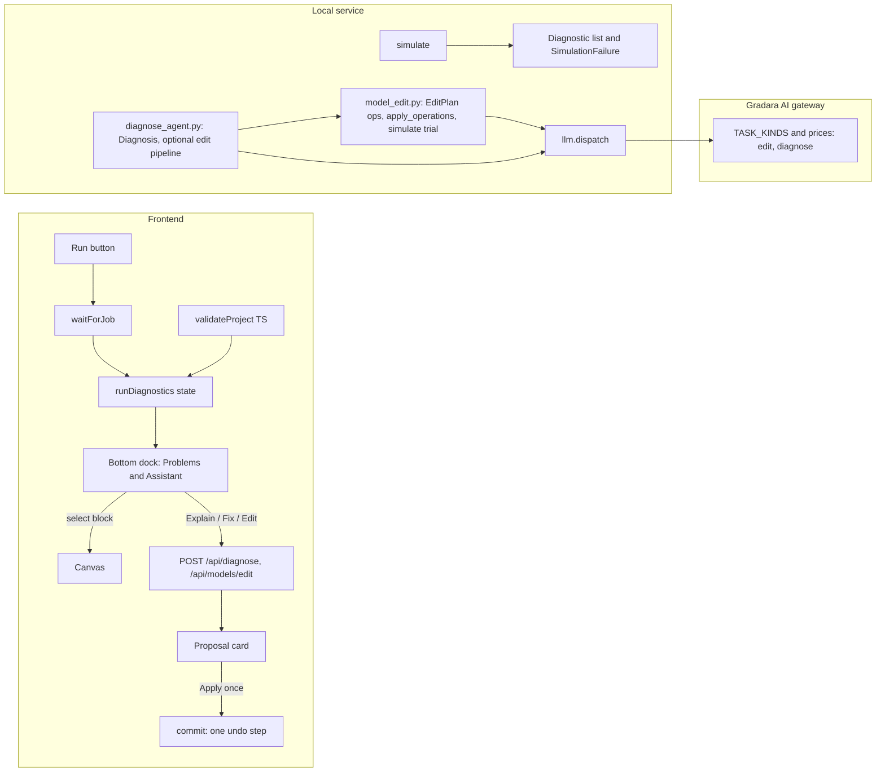

# Execution brief: diagnostics dock, AI diagnosis and editing, C export example, block properties dialog

Branch: `feature/diagnostics-and-ai-editing`. This brief is temporary. When every contract below is documented in `docs/`, the final phase deletes this file and its pointer in [PLAYBOOKS.md](../PLAYBOOKS.md), as [AGENTS.md](../../../AGENTS.md) forbids leaving plans or session diaries in the repository.

Outcomes:

1. Structured diagnostics and a bottom dock under the canvas with a readable Problems list that selects the blocks involved.
2. The AI explains simulation failures and proposes fixes.
3. The AI edits the open diagram (add, remove, rewire, change parameters, revise a block definition) through validated, verified operations that apply as one undo step.
4. A "Servo position control" example built for controller C export, with a reviewed reference C implementation, a trajectory-replay test, and a better Export dialog.
5. The block double-click dialog gains a Properties tab where the name and parameters of every block are editable.

Files that do not exist yet are listed in a fenced block per phase and named without their folder in prose, because `python3 scripts/check-docs.py` rejects backticked repository paths that are not tracked.

## Read first

- [AGENTS.md](../../../AGENTS.md), [PLAYBOOKS.md](../PLAYBOOKS.md) (wiring, API, simulation, agent playbooks), [server/AGENTS.md](../../../server/AGENTS.md), [components/gradara/AGENTS.md](../../../components/gradara/AGENTS.md).
- [EXECUTION.md](../../architecture/EXECUTION.md), [API.md](../../API.md), [MODEL_FORMAT.md](../../architecture/MODEL_FORMAT.md), [WIRING.md](../../architecture/WIRING.md), [PRIVACY.md](../../PRIVACY.md), [AGENT_SETUP.md](../../AGENT_SETUP.md).
- For Phases 6 and 7: [AGENT_BLOCK_GUIDE.md](../../blocks/AGENT_BLOCK_GUIDE.md), [DESIGN.md](../../blocks/DESIGN.md), [DC.md](../../../models/DC.md), [USER_GUIDE.md](../../USER_GUIDE.md).

## Current state (verified on `main` at 5f3ac6b)

- Failures reach the UI as one plain string. `simulate()` in `server/engine.py` raises `RuntimeError`; `perform()` in `server/app.py` stores `JOBS[id].error = str(exc)`; `waitForJob` in `lib/gradara/api.ts` throws; `app/page.tsx` sets `runError`, which is shown only in the Results tab (`.di-error`). The success field `result.diagnostics` (OpenModelica warnings) is never rendered.
- `validate_simulation` and `explain_failure` in `server/diagnostics.py` already know block names and instance IDs but discard the mapping.
- No bottom panel exists. `.main-layout` is `grid-template-rows: 44px minmax(0,1fr)` (`app/engineering.css` ~1851) and `footer.statusbar` is a 25px strip (`app/page.tsx` ~2104).
- AI is generate-only: `server/agent.py` (one Definition; refinement preserves port IDs), `server/model_agent.py` (Plan, then Assembly, then a `simulate` trial; two attempts; repair prompt with `str(exc)[-6000:]`), `server/exporter.py`. `POST /api/models/generate` always creates a new saved model through `/models/copy`. No endpoint accepts the open project.
- Edits are immutable snapshots through `commit()` in `app/page.tsx` (~316): one `commit` is one undo step. Helpers live in `lib/gradara/project.ts` (`addWire`, `replaceDefinition`, `removeSelection`, `pruneJunctions`) and `lib/gradara/normalize-project.ts`.
- Billing: the `dispatch.current_job` contextvar bills one Gradara AI job per top-level operation. The gateway allowlists (`TASK_KINDS`, `JobRef.kind`, `GenerateBody.task`) and `Config.prices` / `max_calls` live in `cloud/gateway/app.py` and `cloud/gateway/config.py`. Prices are also printed in `components/gradara/settings-dialog.tsx` (~656), `lib/gradara/ai.ts` (`Account.prices`, `useAiLabel`), `site/public/index.html` (~170), `docs/AGENT_SETUP.md`, and `cloud/README.md`.
- Tests: `npm test` (Node `tsx --test`, files listed in `package.json`), `.venv/bin/python -m pytest -q -m "not integration"`, `-m integration` for real OpenModelica, `(cd cloud && ../.venv/bin/python -m pytest -q)`.

## Decisions already made (do not reopen)

- Proposals are reviewed before applying. The AI returns a change summary, the user clicks Apply, and the apply is exactly one `commit` (one undo step).
- Gradara AI support ships in the same branch: gateway tasks, prices, docs, and site text change together.
- The AI edit entry point is an Assistant tab in the new bottom dock, next to Problems. The floating composers stay for new blocks and models; "Refine with agent" stays for single definitions.
- AI is never called automatically on a failure. Every AI request is an explicit click (privacy and credits).
- The server applies and verifies edits (it can run `simulate`); the client only commits the returned project. The LLM never returns free-form Project JSON, only bounded operations applied by conventional code.

## Architecture



## Phase 1: structured diagnostics contract (server and api.ts)

```text
new:      tests/test_diagnostics.py
changed:  server/diagnostics.py, server/engine.py, server/app.py, lib/gradara/api.ts, app/page.tsx
docs:     docs/API.md (Job contract), docs/architecture/EXECUTION.md, docs/development/TROUBLESHOOTING.md
```

- In `server/diagnostics.py` add a Pydantic `Diagnostic` (leave the document contract in `server/models.py` untouched):
  - `id`: short stable string such as `d1`
  - `severity`: `error | warning | info`
  - `source`: `validation | safety | compiler | runtime | engine`
  - `message`: readable, using block names, not IDs
  - `detail`: raw excerpt, may be empty
  - `blockIds: list[str]`, `ports: list[{blockId, portId}]`, `netIds: list[str]`, `wireIds: list[str]`
  - `hint: str | None`

  Add `class SimulationFailure(RuntimeError)` carrying `.diagnostics: list[Diagnostic]`. Its `str()` stays the current readable text so existing callers keep working.
- `validate_simulation` builds one Diagnostic per unconnected signal input (with `blockIds` and `ports`) and one per unfinished `mux` / `demux` / `subsystem` block, then raises `SimulationFailure`.
- `explain_failure(project, message)` returns `list[Diagnostic]`. Before replacing instance IDs with names, collect which block IDs appear in the text (word-boundary regex, longest first, as today) and attach them. Keep the algebraic-loop hint as `hint`. Classify `source`: `compiler` for omc `Error:` lines, `runtime` for the simulation log, `engine` for Docker or native availability. Keep the full raw text in `detail`.
- `server/engine.py`: wrap the `check_project` failure (`UnsafeDefinition`) and the post-run checks (no samples, stopped early, non-finite values with the offending `blockId`) in `SimulationFailure`. On success, parse `report['diagnostics']` (OpenModelica warnings) into `result['problems']: list[Diagnostic]` with `severity='warning'`, and keep the `result['diagnostics']` string for compatibility. On failure, write `RUNS/<job>/diagnostics.json`; Phase 4 uses it to give the AI the emitted `model.mo` and logs without re-uploading them from the client.
- `server/app.py` `perform()`: when the exception has `diagnostics`, store `JOBS[id]['diagnostics'] = [d.model_dump() for d in exc.diagnostics]`. The job contract gains optional `diagnostics` on failed jobs. Add `GET /api/runs/{run_id}/diagnostics` returning `diagnostics.json` (alphanumeric run ID check, 404 otherwise).
- `lib/gradara/api.ts`: export `type Diagnostic`; add `Job.diagnostics?: Diagnostic[]` and `SimulationResult.problems?: Diagnostic[]`. `waitForJob` throws `class JobFailure extends Error { diagnostics: Diagnostic[]; jobId: string }` instead of a bare `Error`, with an identical `.message`. `runSimulation` in `app/page.tsx` stores `{ runId, diagnostics }`.
- Tests (test_diagnostics.py): an unconnected input maps to `blockIds` and `ports`; OpenModelica text containing instance IDs maps to `blockIds` with names substituted; singular-system text gets a `hint`; `perform()` records `diagnostics` on a failed job (monkeypatch `simulate` to raise `SimulationFailure`). Integration (`@pytest.mark.integration`): a positive-feedback loop with gain 1 produces a compiler or runtime diagnostic naming the gain block.

## Phase 2: bottom dock with a Problems panel (frontend)

```text
new:      components/gradara/diagnostics-dock.tsx
          components/gradara/problems-panel.tsx
          lib/gradara/validate-project.ts
          tests/validate-project.test.ts   (register it in the package.json test list)
changed:  app/page.tsx, app/engineering.css
docs:     docs/USER_GUIDE.md ("Simulate and inspect"), docs/development/TESTING.md (browser acceptance),
          ROADMAP.md (shrink "Clearer simulation diagnostics")
```

### Layout

- Make `.center-panel` a column flex container. The existing `canvas-wrap` / `results-view-wrap` gets `flex: 1; min-height: 0`, and the dock renders after it in both diagram and results modes, so the library and inspector keep full height and the `.main-layout` rows stay unchanged.
- Dock states: collapsed (28px header strip) and expanded (default 220px; drag handle on the top edge; clamp between 140px and 50% of the center panel height). Persist height and open tab in `localStorage` under `gradara.dock`. Keyboard toggle `Cmd/Ctrl+J`, which must not steal keystrokes from inputs or editors (use the existing shortcut guard in `app/page.tsx`).
- Header: tabs **Problems** (count badges: red for errors, amber for warnings) and **Assistant**; on the right, **Explain** and **Fix with AI** (Phase 4, shown only when errors exist), **Copy**, and a collapse chevron. Style: `--text-ui` 12px, weight 500, background `#f7f9fa`, `border-top: 1px solid #d9e2e8`, 3px radius controls, matching `.statusbar` and `.model-toolbar`.
- Statusbar: keep the existing engine and save segments; add a `problems-summary` button ("No problems" / "2 errors · 1 warning") that toggles the dock.

### Problems list

- Row: severity glyph (error `#c16c6e`, warning `#b8862b`, info `var(--primary)`), message in `--font-ui` 12px `#27333d`, a source badge (Validation / Safety / Compiler / Runtime / Engine) in micro caps, block chips (block name with a domain color dot) and port chips. Clicking a chip selects the blocks through the existing selection state and centers them with React Flow `setCenter` / `fitView`. Keyboard: Up/Down moves, Enter selects, Space expands. An expanded row shows `detail` in `--font-code` 11px in a `pre` with `max-height: 40%` and scrolling; `hint` renders above it in a quiet callout.
- Sections, in order: live validation; last run (labelled "from last run", which becomes "stale: model changed" when `semanticSignature(project) !== resultSignature`); warnings from a successful run (`result.problems`). Empty state: "No problems. Run the model to check it in OpenModelica." Never hide raw text and never claim success from partial output.
- On a failed run the dock auto-expands to Problems and the workspace stays on the Diagram. Results keeps the same error text. Do not switch to Results.

### Live validation

- `validateProject(project): Diagnostic[]` (validate-project.ts) mirrors `validate_simulation` (unconnected signal inputs, unfinished mux/demux/subsystem) and adds cheap authoring checks: a block with no connections at all is `info`; a wire endpoint pointing at a missing port is `error`. Compute with `useMemo` keyed on `semanticSignature(project)` and a 300ms debounce, never per pointer move.

### Tests and acceptance

- Node test for `validateProject` on variants of `tests/motor-project.json`.
- Browser checklist: a failed run expands the dock, and clicking a chip selects and centers the block; drag-resize and collapse persist across reload; in narrow layouts (under 700px) the dock is hidden and the statusbar counts remain; Escape and undo/redo are unaffected; the Results tab still shows the error.

## Phase 3: AI model editing (server pipeline, `/api/models/edit`, Assistant tab)

```text
new:      server/model_edit.py
          tests/test_model_edit.py
          components/gradara/assistant-panel.tsx
          components/gradara/proposal-card.tsx
changed:  server/app.py, server/llm/dispatch.py (task labels), server/model_agent.py (shared catalog helper, provider label),
          lib/gradara/api.ts, lib/gradara/ai.ts (kind union and Account.prices gain edit and diagnose), app/page.tsx
docs:     docs/API.md, docs/architecture/EXECUTION.md (new "Model editing" section), docs/USER_GUIDE.md,
          docs/AGENT_SETUP.md, docs/PRIVACY.md ("AI requests" gains: open model semantic content, selection,
          emitted Modelica, diagnostics)
```

### Request and LLM schema (all `Strict`, in the style of `server/model_agent.py`)

- `ModelEditRequest`: `prompt` (3–4000 chars), `project: Project`, `catalog: list[Definition]` (1–300, the UI built-in catalog, as for model generation), `selection: list[str]` (block IDs, at most 200), `verify: bool = True`, `context: str | None` (at most 6000; Phase 4 passes diagnostics text here).
- `EditPlan` (LLM output): `summary` (≤600), `assumptions` (≤8), `unsupported` (≤1000; non-empty means refuse), `operations: list[Operation]` (1–40).
- `Operation` is one flat model with an `op` enum and nullable arguments. Strict vendor schemas require every key, so use `Optional` fields, which become `anyOf [..., null]`:

| `op` | Arguments | Realized by |
| --- | --- | --- |
| `add_block` | `libraryId`, `alias`, `name`, `parameters[]`, `near` (block ID or null) | catalog copy |
| `create_block` | `alias`, `blockType`, `prompt`; at most 2 per plan | `agent.generate_component` |
| `revise_definition` | `blockId`, `prompt` | `agent.generate_component(prompt, existing=block.definition)`, which preserves port IDs |
| `remove_block` | `blockId` | `apply_operations` |
| `rename_block` | `blockId`, `name` | `apply_operations` |
| `set_parameter` | `blockId`, `parameterId`, `value` | `apply_operations` |
| `connect` | `source`, `sourcePort`, `target`, `targetPort` (existing IDs or new aliases) | `apply_operations` |
| `disconnect` | `wireId`, or the four endpoint fields | `apply_operations` |
| `set_duration` | `duration` (≤ 86400, per `Project` bounds) | `apply_operations` |

- Prompt content: instructions (edit only what is asked; keep IDs; reuse the catalog; signals run output to input; physical domains must match; keep grounds and references), the user prompt, the names of selected blocks, `semantic_view(project)` (the project with `position`, `size`, `rotation`, `labelOffset`, `waypoints`, `junctions`, `plots`, and `annotations` removed, to save tokens), and the catalog description. Move `describe(catalog)` out of `server/model_agent.py` into a shared helper rather than duplicating it.

### `apply_operations(project, plan, catalog, generated) -> tuple[Project, list[Change]]`

Pure and all-or-nothing; raises `ValueError` with readable messages.

- Deep-copy the project. Resolve aliases: `new:<alias>` definitions from `create_block`, `b_<alias>` IDs for added blocks, made unique against existing IDs. Provisional positions for added blocks: right of `near` at +320px, stepping down 224px to a free cell; otherwise right of the bounding box.
- `connect`: validate port existence and the direction law (signal: exactly one driver per input, output to input; physical: same domain, any terminals). Reject duplicates and self connections with the same pair rule as `assemble()`. New wires have no `waypoints`, so the client router draws them. Existing wires, waypoints, junctions, nets, labels, plots, `modelId`, and `revision` stay untouched unless an operation targets them.
- `remove_block` / `disconnect`: remove incident wires, drop their IDs from `nets[].wireIds`, delete nets left empty. Junction pruning is left to the client's `normalizeProject`.
- `set_parameter`: assign, then `Definition.model_validate(model_dump())` to re-run range validators (the same approach as `assemble()`).
- `Change` is `{op, blockIds, wireIds, description}`, used by the review card.

### Pipeline `edit_model(request, job_id, progress)`

Two attempts, like `generate_model`:

1. Plan (dispatch task `edit-plan`).
2. Realize `create_block` / `revise_definition` with `agent.generate_component` (task `component`), reporting progress.
3. `apply_operations`, then `validate_simulation` and `check_project`.
4. If `verify`, `simulate(project, f'{job_id}trial{attempt}')`.

On an exception in attempt 0, append the previous plan JSON and `str(exc)[-6000:]` to the prompt and retry. If attempt 1 also fails verification, return the proposal with `verified: False` and the structured diagnostics instead of raising, so the user can inspect or knowingly apply it. A plan that cannot be applied at all (`ValueError` from `apply_operations` on both attempts) raises. Cancellation propagates without a repair attempt.

Result: `{project (exclude_none), summary, assumptions, changes, generated, verified, diagnostics, samples?, provider}` with `provider` from `dispatch.LABELS`. Fix the hard-coded `'provider': 'Codex'` in `server/model_agent.py` in the same change.

Endpoint: `POST /api/models/edit` starts `start_job('edit', ...)` with progress.

### Frontend

- AssistantPanel (dock tab): a thread of local messages per `modelId` (React state, cleared on model switch, not persisted). Textarea placeholder "Describe a change to this model…", `Cmd/Ctrl+Enter` submits. Context chips "Whole model" / "Selection: N blocks" from `selectedIds`. Cost and provider footer from `useAiLabel('edit')`; progress line from `job.progress`; Cancel through `DELETE /jobs/{id}` as in the composers. AI-off and sign-in states reuse the composer messaging.
- ProposalCard: summary, assumptions, and changes grouped as Added / Removed / Changed / Rewired, with block chips (hover highlights, click selects on the canvas); a verification badge ("Checked in OpenModelica · N samples", or "Not verified" with the diagnostics inline); buttons Apply / Discard / Refine (Refine prefills the textarea). Record `baseRevision` at request time; if `project.revision` has moved, disable Apply with "Model changed since this proposal — ask again".
- `applyProposal` in `app/page.tsx`: take `proposal.project`, re-snap added blocks with `snapBlockPosition(defaultBlockSize(definition))`, then `commit(next)` once (through `normalizeProject`, which reconciles nets and prunes junctions). Select the added and changed blocks, `notify('Applied N changes. Undo with ⌘Z.')`, and mark run diagnostics stale. Never call `/models/copy`.

### Tests

- test_model_edit.py: each operation on `tests/motor-project.json`; rejections (unknown block, second driver on a signal input, domain mismatch, parameter out of range, duplicate connection, self connection, more than two `create_block`); all-or-nothing on a mixed valid/invalid plan; IDs, waypoints, nets, `modelId`, and untouched parameters preserved.
- Pipeline with mocked `structured_generation`, `generate_component`, and `simulate`: success, repair then success, unverified return, cancellation without repair, `unsupported` refusal. `/api/models/edit` job round trip through the local-service test client.
- Node test for `applyProposal` snapping and single-commit behavior where feasible.

## Phase 4: AI diagnosis, Explain and Fix

```text
new:      server/diagnose_agent.py
          tests/test_diagnose_agent.py
changed:  server/app.py, components/gradara/problems-panel.tsx, components/gradara/assistant-panel.tsx
docs:     docs/API.md, docs/architecture/EXECUTION.md, docs/USER_GUIDE.md, docs/AGENT_SETUP.md, docs/PRIVACY.md
```

- `DiagnoseRequest`: `project`, `diagnostics: list[Diagnostic]` (1–50), `runId: str | None`, `catalog`, `question: str | None` (≤2000), `proposeFix: bool`. If `runId` is alphanumeric and `RUNS/<runId>/project.json` has the same `modelId`, include the emitted `model.mo` and the last 8k of the `diagnostics.json` detail server-side; otherwise ignore `runId`.
- Stage 1, schema `Diagnosis` (task `diagnose`): `summary` (≤800), `causes[] {diagnosticIds[], blockIds[], explanation}`, `fixable: bool`, `manualSteps[]` (≤8), `editPrompt: str | None` (a self-contained instruction for the edit pipeline).
- Stage 2, only when `proposeFix and fixable and editPrompt`: call `model_edit.edit_model` with `editPrompt`, `context` set to the diagnostics text, and `verify=True`. The result has the same proposal shape as Phase 3.
- Result `{diagnosis, proposal | None, provider}`. Endpoint `POST /api/diagnose` starts a job of kind `diagnose` with progress.
- UI: the Problems header offers **Explain** (`proposeFix: false`) and **Fix with AI** (`proposeFix: true`); each row gets "Ask AI about this", which sends only that diagnostic. Answers render in the Assistant tab: causes with block chips (click selects), manual steps, then the shared ProposalCard. The dock switches to Assistant when the answer arrives. Cost label from `useAiLabel('diagnose')`.
- Tests: mocked generation for explain-only, fixable with a proposal, and `fixable=false`; `runId` guards (non-alphanumeric, missing folder, mismatched `modelId`); no AI call happens without a request (the `runSimulation` failure path never hits `/api/diagnose`).

## Phase 5: gateway, pricing, privacy, docs, roadmap

```text
changed:  cloud/gateway/app.py, cloud/gateway/config.py, cloud/gateway/store.py (if max_calls is validated per kind),
          cloud/tests/test_gateway.py, components/gradara/settings-dialog.tsx, lib/gradara/ai.ts
docs:     cloud/README.md, site/public/index.html, site/public/privacy.html, docs/AGENT_SETUP.md, docs/PRIVACY.md,
          docs/USER_GUIDE.md, ROADMAP.md
```

- Gateway: `TASK_KINDS` gains `'edit-plan': {'edit', 'diagnose'}` and `'diagnose': {'diagnose'}`, and `'component'` also accepts kinds `edit` and `diagnose`. `JobRef.kind` pattern becomes `^(component|model|export|edit|diagnose)$`; the `GenerateBody.task` pattern adds `edit-plan|diagnose`.
- Default `prices`: `edit: 6`, `diagnose: 6` (one price per job, repairs included, as today). `max_calls`: `edit: 8`, `diagnose: 10`. **These numbers are a maintainer decision.** Flag them in the PR and keep them identical everywhere they are printed.
- Tests in `cloud/tests/test_gateway.py`: the new kinds charge once per job; unknown task/kind combinations are rejected; the privacy test still proves no prompt is stored.
- Update every price and context statement together: the pricing sentence and Privacy & data text in `components/gradara/settings-dialog.tsx`, the `Account.prices` type, the pricing grid in `site/public/index.html`, "AI requests" in `site/public/privacy.html` and `docs/PRIVACY.md` (new contexts: the open model without layout, the selection, emitted Modelica, diagnostics), costs and "What runs where" in `docs/AGENT_SETUP.md`, and the pricing section of `cloud/README.md`.
- `ROADMAP.md`: remove the "Clearer simulation diagnostics" row; add no speculative items. `docs/USER_GUIDE.md`: a new "Problems and Assistant" section. `git grep -n` for the old behavior (run failures shown only in Results, model builds that always create a new model) and fix every hit.
- Final step of the branch: delete this brief and its pointer in [PLAYBOOKS.md](../PLAYBOOKS.md) once every contract is documented in `docs/`; run `python3 scripts/check-docs.py` and `python3 scripts/check-repo.py`.

## Phase 6: C code generation example, "Servo position control"

Independent of Phases 1–5; it can be built first or in parallel. Follow the block playbook and [AGENT_BLOCK_GUIDE.md](../../blocks/AGENT_BLOCK_GUIDE.md) for the two new blocks.

```text
new:      scripts/build-servo-example.ts
          models/examples/servo.json
          docs/examples/SERVO.md
          tests/fixtures/servo-controller/gradara_controller.h   hand-reviewed reference matching discretePID exactly
          tests/fixtures/servo-controller/gradara_controller.c
          tests/fixtures/servo-controller/harness.c              reads t,reference,measured rows from stdin, prints y per step
          tests/test_exporter.py                                  unit and integration coverage described below
changed:  lib/gradara/model.ts or lib/gradara/extra-blocks.ts (discretePID), the mechanical block module (angleSensor),
          server/modelica.py, server/exporter.py, components/gradara/export-dialog.tsx,
          server/app.py, server/workspace.py, server/models.py, lib/gradara/workspace.ts,
          tests/examples.test.ts, tests/test_workspace.py
docs:     docs/USER_GUIDE.md, docs/architecture/EXECUTION.md, docs/development/TESTING.md, ROADMAP.md,
          docs/blocks/DESIGN.md (only if size or notation rules change)
```

### Current state

`export_controller` in `server/exporter.py` exports exactly one block whose `definition.controller` is true. It sends `component_source(definition, 'Controller')` plus adjacent wires to the LLM with `EXPORT_SCHEMA {header, source, notes}`, compiles with `gcc -std=c11 -Wall -Wextra -Werror -c` (two attempts, `engines.compile_c`), zips `gradara_controller.c`, `gradara_controller.h`, `controller-package.json`, and `README.md` under `EXPORTS/<job>/`, and returns `{id, header, source, notes, compiled}`. Only `pi` (sampled, in `lib/gradara/model.ts`), `currentPI`, and `pid` (both continuous) ship with `controller: true`. There are no exporter tests, no behavioral check against the Modelica run, no in-dialog code preview, and no controller picker in `components/gradara/export-dialog.tsx` (it uses the selected block or the first controller). There is no angle sensor: `sensor` measures speed (`y = der(flange.phi)`).

### New blocks (shared `BlockFace` rendering, standard size rules, stable IDs)

- `discretePID` (signal, `controller: true`, control category): inputs `reference` and `measured`, output `y`, like `pi`. Parameters `kp`, `ki`, `kd`, `filterTime` (derivative filter time constant, s), `limit` (output limit), `samplePeriod` (s, default 0.001). All equations sit inside `when sample(0, samplePeriod)` with discrete states `integral`, `derivative`, and `errorPrev`; the integral is clamped for anti-windup (same policy as `pi`); the derivative is a first-order filtered backward difference; the output saturates. Because it is sampled, the C implementation reproduces it exactly; the example note explains this choice.
- `angleSensor` (mechanical, physical): a `flange` terminal and output `y` in rad. Canonical wrapper in `server/modelica.py` (`y = flange.phi; flange.tau = 0;`), mirrored in the TypeScript library. Register the kind everywhere `sensor` is registered (library array and wrapper map; `server/engine.py` picks up the output port automatically).

### Example model `servo`

- The builder (build-servo-example.ts) follows `scripts/build-buck-example.ts`; its output (servo.json) is styled through `scripts/style-examples.ts`.
- Signal path: position `step` (1 rad at 0.2 s) → `discretePID` (name "Position controller") → `voltage` drive → DC `motor` → `inertia` → `angleSensor`, whose output feeds `measured`. Keep the DC example values (R 1.2 Ω, L 20 mH, k 0.15 N·m/A, J 0.02 kg·m², friction 0.002 N·m·s). Duration 2 s. Default plots: position request against measured angle, and controller output voltage.
- Tune the gains so the response settles without staying at the 24 V limit for the whole step. A short saturation interval is fine and instructive.
- Registration checklist, every place must change:
  1. servo.json under `models/examples/`
  2. `load_example` whitelist in `server/app.py` (~164)
  3. template set in `server/workspace.py` (~147)
  4. `NewModelRequest.template` literal in `server/models.py` (~290)
  5. `modelTemplates` in `lib/gradara/workspace.ts` (title "Servo position", detail "Control · Electrical · Mechanical · C export")
  6. the name list in `tests/examples.test.ts`
  7. the template parametrize in `tests/test_workspace.py` (~121)
  8. the example note SERVO.md under `docs/examples/`
  9. the README examples list, if one exists

### Reference C export and replay harness (checked in, reviewed, tested)

- The reference follows the contract in the export prompt: `gradara_controller_params` / `_state` / `_inputs` / `_outputs` structs, `gradara_controller_init(params, state)`, `gradara_controller_step(params, state, inputs, outputs)`, the sample time exposed, only `math.h`, `stdint.h`, `stdbool.h`, `stddef.h`, no `main`, no allocation or I/O. It compiles with the same `-std=c11 -Wall -Wextra -Werror` flags.
- Trajectory replay test (`@pytest.mark.integration`): simulate servo.json through `simulate()`; from the run CSV, extract `reference`, `measured` (angle sensor output), and controller `y` at each sample instant; feed the first two into the compiled harness; assert the C output matches the Modelica controller output within 1e-6 absolute at every sample. Skip with a clear reason when no C compiler is available (`engines.compile_c` already reports that).
- Exporter unit tests (no provider; gcc optional): mock `agent.structured_generation` to return the reference C. Assert that `export_controller` rejects a non-controller block, compiles once, writes the four files and the zip, and that a failing first compile triggers exactly one repair attempt with the compiler output in the prompt. Assert a `POST /api/exports` round trip through the local-service test client.
- Exporter improvements: include the detected sample-period parameter (`samplePeriod` or `Ts`) and the list of discrete states in `boundary['target']` so the prompt does not have to infer them; make sure the returned `notes` are written into the zip `README.md` (fix it if not); keep the `export` task and price unchanged.

### Export dialog (`components/gradara/export-dialog.tsx`)

- Controller picker: a select listing every `controller` block (name and kind), preselected from the current selection. When none exist, show a disabled state with "Mark a signal block as a controller in the inspector". FOC then exports the chosen current PI instead of the first one found.
- Result view: read-only tabs `gradara_controller.h` / `gradara_controller.c` / Notes in `--font-code` 12px (Monaco is already lazy-loaded by the equation editor; a styled `pre` is acceptable), a Copy button per tab, Download zip, and the compile evidence line "Compiled with gcc -std=c11 -Wall -Wextra -Werror". Leave the Modelica source and project JSON paths untouched.

### Docs

- SERVO.md: model description and a parameter table like [DC.md](../../../models/DC.md); an "Export the controller to C" walkthrough (select the controller → Export → Generate C controller → preview → download); an excerpt of the reference `step` function beside the Modelica `when` clause; what the replay test proves and what it does not (compilation plus sampled input/output equivalence, not hardware timing or a complete drive).
- Update "Ask for a component or export" in `docs/USER_GUIDE.md` (picker and preview), "Controller C export" in `docs/architecture/EXECUTION.md` (boundary fields, reference fixture, replay test), `docs/development/TESTING.md` (how to run the replay test), and `ROADMAP.md` item 3, shrunk to what remains (continuous controllers still rely on the LLM's discretization; no closed-loop C co-simulation).

## Phase 7: block dialog with editable properties on double-click

Independent of the other phases, and small.

```text
new:      components/gradara/block-dialog.tsx      (replaces components/gradara/equation-editor.tsx)
          components/gradara/parameter-list.tsx
changed:  app/page.tsx, lib/gradara/project.ts, tests/project.test.ts
docs:     docs/USER_GUIDE.md (~33), docs/development/TESTING.md (browser checklist item 1)
```

### Current state

`onNodeDoubleClick` in `app/page.tsx` (~1630) sets `equationBlock`, which renders `components/gradara/equation-editor.tsx`: a `.source-dialog` with tabs Equations and State & declarations, Monaco, read-only for built-in physical blocks, and `onApply` calling `commit(p => replaceDefinition(...))`. Parameters are editable only in the inspector (`app/page.tsx` ~1893–1940, one `commit` per `NumberField` change; name through `NameField`, ~1854).

### Changes

- Rename the equation editor to block-dialog.tsx and keep the `.source-dialog` class so the styles in `app/globals.css` (~1530) and `app/workbench-dialogs.css` still apply. Tabs: **Properties** (default when opened by double-click), **Equations**, **State & declarations**. The inspector's "Equations → Open" opens the same dialog on Equations. Add an "Edit…" affordance to the inspector Parameters header that opens it on Properties.
- Properties tab: name (`NameField`); description (read-only); parameter rows with label, `NumberField` with `min`/`max`, and unit, plus a per-row "Reset" to the library default for built-in kinds (`library.find(d => d.kind === definition.kind)`); the interface list (ports with direction and domain, read-only); kind and block ID shown quietly. This works for every block, including physical ones such as a resistor's `R` or a gain's `k`. Only equations stay read-only for built-in physical definitions.
- Extract the parameter row into parameter-list.tsx and use it from both the inspector and the dialog so styling and validation cannot drift.
- Editing model: the dialog stages changes locally and applies them with one `commit` on **Apply** (Enter in a field also applies), so the whole dialog session is one undo step. **Cancel** and Escape discard. Apply is disabled while nothing changed and shows a dirty dot otherwise.
- Add a pure helper `applyBlockEdits(project, blockId, { name?, parameters?, equations?, declarations? })` to `lib/gradara/project.ts`. It maps the block, calls `replaceDefinition` only when equations or declarations changed (so unchanged ports never drop wires), and returns the same object when nothing changed (so `commit` is a no-op). Notify "Run the model to apply them" only when equations changed; parameter edits already invalidate results through `semanticSignature`.
- Keep the double-click contract: no add-block picker, `tap` nodes ignored, and canvas shortcuts must not fire while typing in the dialog (`NumberField` inputs and Monaco).

### Tests and acceptance

- `tests/project.test.ts` cases for `applyBlockEdits`: unrelated parameters and wires preserved; no-op identity; the equations path drops incompatible wires exactly as `replaceDefinition` does.
- Browser: double-clicking a Gain opens the dialog on Properties with focus in the first field; changing `k` and applying produces one undo step and stale results; Escape discards; double-clicking a resistor shows `R` editable and Equations read-only; double-clicking a Step still does not open the picker.
- Docs: `docs/USER_GUIDE.md` (~33) says "Double-click a block to edit its properties; the Equations tab …"; item 1 of the browser checklist in `docs/development/TESTING.md` says the block dialog opens on Properties instead of "the equation editor opens".

## Verification to run and report

- `npm run typecheck`, `npm run lint` (report the known backlog; do not suppress rules), `npm test`.
- `.venv/bin/python -m pytest -q -m "not integration"`; `.venv/bin/python -m pytest -q -m integration` with a real engine (Phase 1, 3, and 4 trial simulations; Phase 6 servo run and C replay); `(cd cloud && ../.venv/bin/python -m pytest -q)`.
- `python3 scripts/check-docs.py`, `python3 scripts/check-repo.py`, and `npm run report:blocks` after adding the two blocks (inspect it; do not commit the report).
- Browser acceptance in a real browser (see [SETUP.md](../../development/SETUP.md) for the launcher):
  - a failed run expands the dock, and chips select and center blocks; resize and collapse persist;
  - Explain and Fix with a real provider (name the provider; never commit credentials);
  - Apply produces exactly one undo step and preserves manual routes, labels, plots, and `modelId`; a stale proposal is blocked after an edit;
  - the Assistant edit "add a scope on the motor speed and connect it" works on the DC motor example;
  - Escape, undo/redo, and typing in inputs are unaffected by `Cmd/Ctrl+J`;
  - the Servo example runs; its controller exports to C with a real provider; preview, copy, and download work; the FOC picker offers both current PIs;
  - the Phase 7 block dialog checks.
- Handoff per [PLAYBOOKS.md](../PLAYBOOKS.md): behavior, changed contracts, exact commands and results, and limitations (layout of added blocks is provisional; diagnostics-to-net mapping is best effort; the replay test checks sampled input/output equivalence, not a closed-loop C simulation).

## Commits and pull requests

- One commit (or stacked PR) per phase on `feature/diagnostics-and-ai-editing`, with short git messages and the PR template filled on GitHub.
- Suggested order: 7 (small UI), 6 (example, blocks, export dialog), 1, 2, 3, 4, 5. Phases 1, 2, 6, and 7 ship without AI changes; 3–5 depend on 1. Do not merge Phase 3 or 4 without Phase 5's gateway change, or Gradara AI users get a 4xx from the gateway.

## Out of scope (state this in the handoff; do not build)

Token streaming; persisted chat history; automatic AI calls on failure; general layout optimization of AI-added blocks; editing built-in library definitions in place (`revise_definition` produces a generated definition on that instance instead); multi-model edits; hierarchical subsystems; whole-FOC firmware export or closed-loop C co-simulation; adding or removing parameters from the block dialog (definitions change through the equation tabs or the agent).
