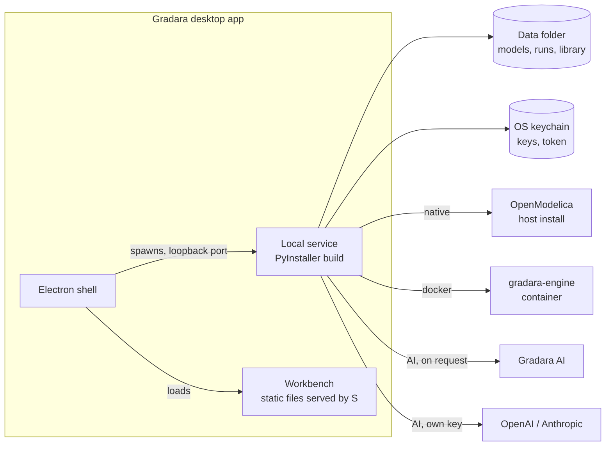
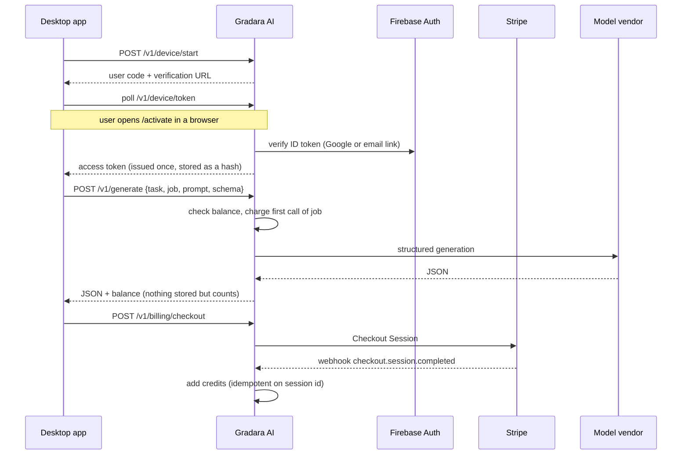

# Distribution, AI service, and monetization

One repository produces three things: the developer checkout, installable desktop apps, and the hosted Gradara AI service. The code is shared. The builds and their defaults are what differ.

| Product | Who uses it | How it runs | AI default |
| --- | --- | --- | --- |
| Source checkout | Contributors, tinkerers, forks | `scripts/start.py`: Vite dev server plus the local service | Codex CLI if installed, otherwise Gradara AI |
| Desktop app | Engineers who want to install and go | Electron shell plus a frozen local service and static workbench | Gradara AI (prepaid credits) |
| Gradara AI service (`cloud/`) | Desktop and source users who choose it | Container on Cloud Run with PostgreSQL | Not applicable |
| Website (`site/`) | Visitors choosing and downloading Gradara | Static files on Firebase Hosting, [gradara.app](https://gradara.app/) | Not applicable |

Everything is Apache-2.0. The paid product is the hosted service and the convenience of signed, updating installers, not closed code. Anyone can use their own API key or build their own copy; the "Gradara" name and official builds identify the maintained distribution.

## Repository layout

```
app/, components/, lib/      Workbench UI (shared by dev server and desktop build)
server/                      Local service (FastAPI)
  engines.py                 OpenModelica backends: native install or Docker image
  llm/                       AI providers: gradara (hosted), openai, anthropic, codex
    providers.py, schema.py  Dependency-light; also used by cloud/
  paths.py, settings.py,     Data folder, preferences, keychain secrets
  credentials.py
  safety.py                  Screens definitions before any compiler sees them
desktop/                     Electron shell and electron-builder config
  web/                       Static entry for the desktop workbench build
packaging/                   PyInstaller entry, build, and smoke test for the service
cloud/                       Gradara AI gateway, sign-in pages, Dockerfile, tests
.github/workflows/           ci, engine, native-engine, cloud, release
```

## Desktop app



- The shell picks a free loopback port, starts the service with `GRADARA_DATA_DIR`, `GRADARA_STATIC_DIR`, and `GRADARA_RESOURCES`, waits for it, then loads the workbench. Quitting stops the service and its process tree.
- The data folder is `<OS app data>/Gradara/data`. Logs are in `<OS app data>/Gradara/logs`. Help menu entries open both.
- The workbench is the same React app built without server rendering (`vite.desktop.config.ts`, mode `desktop`).
- Installers: NSIS on Windows, DMG and ZIP per architecture on macOS, AppImage and deb on Linux. Updates use electron-updater against GitHub Releases.

### Simulation engine per platform

| Platform | Default path | First-run setup in the app |
| --- | --- | --- |
| Windows | Native OpenModelica (official installer) | Download OpenModelica, then "Set up now" installs MSL 4.1.0 |
| Linux | Native OpenModelica packages, otherwise Docker | Same, or Docker image download |
| macOS | Docker-compatible runtime (OrbStack, Docker Desktop, Colima) | Install a runtime, then "Set up now" pulls the engine image |

`auto` prefers a ready native install, then a ready Docker image. Both backends produce the same run folder, CSV, and report, so results and plots do not depend on the backend.

The native backend drives `omc` with a generated `.mos` script, and writes each result field to a small file so parsing does not depend on omc's printed record format. It runs as the user, without the container's isolation, so `safety.py` rejects `external`, `Modelica.Utilities`, annotations, imports, class definitions, and string literals in editable definition text before either backend compiles it. The document schema already rejects most of these; the screen is defense in depth.

OpenModelica does not publish macOS builds (discontinued after 1.16), which is why macOS uses the container. See the roadmap for the embedded-VM and bundled-engine follow-ups.

## AI providers

Every AI feature calls `server/llm/dispatch.generate(prompt, schema, …)`. Each call is one schema-constrained generation; conventional code validates the result, compiles it, and asks for a bounded repair when needed.

| Provider | Setup | Billing | Data path |
| --- | --- | --- | --- |
| Gradara AI | Sign in (device code in the browser) | Prepaid credits | App → Gradara AI → model vendor |
| OpenAI / Anthropic | Paste an API key (verified with a free models-list call) | The user's vendor account | App → vendor |
| Codex CLI | Installed and signed in | The user's Codex plan | App → Codex CLI |
| Off | None | None | None |

A top-level operation (one block, one model build, one C export) sets `current_job`. Gradara AI charges once per operation, on its first call, so repair attempts and the blocks created inside a model build are included.

## Gradara AI service



Design decisions:

- **Credits per operation, not tokens.** Engineers reason about "a block" or "a model," and fixed prices insulate users from vendor price changes. Measured usage from development runs: about 16k tokens per block and 80k to 130k tokens per full model build.
- **Prepaid packs through Stripe Checkout.** No stored cards, no invoices, no surprise overages. Stripe Tax can be enabled with `STRIPE_AUTOMATIC_TAX`.
- **Failed first calls are refunded.** If the vendor fails before any output, the operation's charge is returned; a later retry pays again.
- **Task allowlist.** Only Gradara task types with a JSON object schema are accepted, with size limits, per-account rate and concurrency limits, and a per-operation call cap. The gateway is not a general chat proxy.
- **Device-code sign-in.** No custom URL schemes or localhost callbacks, and no passwords in the app.
- **One provider layer.** `server/llm/providers.py` serves both bring-your-own-key calls and the gateway, so structured-output handling is maintained once.

Current defaults, all configurable on the server: block 2 credits, model build 20, C export 2; packs of 100 credits for USD 10 and 550 credits for USD 50; 20 welcome credits per verified identity. See `cloud/README.md` for deployment and [privacy](../PRIVACY.md) for data handling.
