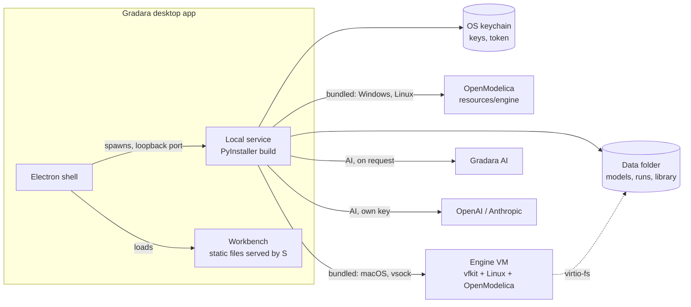
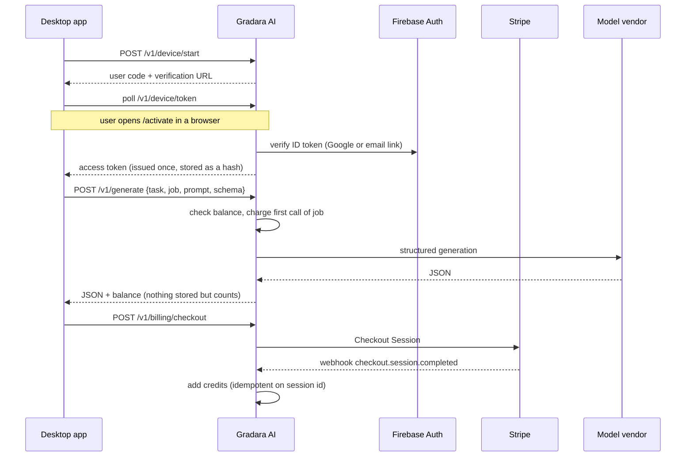

# Distribution, AI service, and monetization

One repository produces four things: the developer checkout, installable desktop apps, the hosted Gradara AI service, and the gradara.app website. The code is shared. The builds and their defaults are what differ.

| Product | Who uses it | How it runs | AI default |
| --- | --- | --- | --- |
| Source checkout | Contributors, tinkerers, forks | `scripts/start.py`: Vite dev server plus the local service | Codex CLI if installed, otherwise Gradara AI |
| Desktop app | Engineers who want to install and go | Electron shell plus a frozen local service, a static workbench, and a built-in OpenModelica engine | Gradara AI (prepaid credits) |
| Gradara AI service (`cloud/`) | Desktop and source users who choose it | Container on Cloud Run with PostgreSQL | Not applicable |
| Website (`site/`) | Visitors choosing and downloading Gradara | Static files on Firebase Hosting, [gradara.app](https://gradara.app/) | Not applicable |

Everything is Apache-2.0. The paid product is the hosted service and the convenience of signed, updating installers, not closed code. Anyone can use their own API key or build their own copy; the "Gradara" name and official builds identify the maintained distribution.

## Repository layout

```
app/, components/, lib/      Workbench UI (shared by dev server and desktop build)
server/                      Local service (FastAPI)
  engines.py                 OpenModelica backends: built-in (bundled), native install, or Docker image
  llm/                       AI providers: gradara (hosted), openai, anthropic, codex
    providers.py, schema.py  Dependency-light; also used by cloud/
  paths.py, settings.py,     Data folder, preferences, keychain secrets
  credentials.py
  safety.py                  Screens definitions before any compiler sees them
desktop/                     Electron shell and electron-builder config
  web/                       Static entry for the desktop workbench build
packaging/                   PyInstaller entry, build, and smoke test for the service
  engine/                    Built-in engine builds (Windows, Linux, macOS VM image and agent)
cloud/                       Gradara AI gateway, sign-in pages, Dockerfile, deploy.sh, tests
site/                        gradara.app (static files for Firebase Hosting)
.github/workflows/           ci, engine, native-engine, engine-bundle, cloud, release, site
```

## Desktop app



- The shell picks a free loopback port, starts the service with `GRADARA_PORT`, `GRADARA_DATA_DIR`, `GRADARA_LOG_DIR`, `GRADARA_STATIC_DIR`, `GRADARA_RESOURCES`, and `GRADARA_VERSION`, waits for it, then loads the workbench. Quitting stops the service and its process tree.
- The data folder is `<OS app data>/Gradara/data`. Logs are in `<OS app data>/Gradara/logs`. Help menu entries open both. **Help → Copy Diagnostic Info** copies versions, the engine status, and the end of `service.log`; **Help → Third-Party Licenses** opens `legal/THIRD_PARTY_LICENSES.txt`. The About panel carries the not-for-safety-critical-use note. **View → Reset Layout** restores the workbench's panel sizes and dock.
- The workbench is the same React app built without server rendering (`vite.desktop.config.ts`, mode `desktop`).
- Installers: NSIS on Windows, DMG and ZIP per architecture on macOS, AppImage and deb on Linux. Updates use electron-updater against published GitHub Releases (drafts are never offered). The shell checks 10 seconds after launch and every four hours, downloads in the background, and installs on **Restart to update** or on the next quit. It publishes its state to the workbench through `desktop/preload.cjs`, the only bridge between page and shell (update status, check, install), and accepts those calls only from the local workbench. Windows, macOS (signed builds) and the Linux AppImage update in place; the .deb only reports a new version and links to the download page. `GRADARA_DISABLE_UPDATES=1`, development runs, and self-test runs turn update checks off, and the installer self-test verifies that the bridge reports `disabled`.

### Simulation engine per platform

For the full list of platforms and their CI coverage, see [supported platforms](../PLATFORMS.md).

Every installer carries OpenModelica 1.27.1 and the Modelica Standard Library 4.1.0 in `resources/engine` (with a `manifest.json`), and the **bundled** backend uses it by default. Nothing is downloaded on first run.

| Platform | Built-in engine | How it runs | Size (compressed) |
| --- | --- | --- | --- |
| Windows | OpenModelica tree trimmed from the official installer: `omc` and its DLLs, the C runtime and headers, and the MSYS2 ucrt64 toolchain packages its `Compile.bat` needs, chosen from the MSYS2 package database and PE imports (`packaging/engine/trim_windows.py`) | As a native install with `OPENMODELICAHOME` and `OPENMODELICALIBRARY` set to the bundle | About 115 MB |
| Linux | OpenModelica from its Ubuntu 22.04 packages, relocated, with the shared libraries it needs beyond glibc, the gcc runtime, zlib and OpenSSL, plus GNU make (`packaging/engine/build-linux.sh`) | As a native install, adding the bundle's libraries to `LD_LIBRARY_PATH`; compiles with the system `gcc`, which the `.deb` depends on | About 45 MB |
| macOS | A Linux VM: squashfs root (Ubuntu 24.04, OpenModelica, gcc, make, Python, MSL), the Ubuntu kernel, the command agent, and vfkit (`packaging/engine/build-macos-guest.sh`), one per architecture | vfkit boots it with Apple's Virtualization framework on first use; the data folder is shared over virtio-fs; commands go over vsock. No network device. Needs macOS 13 | About 150 MB |

OpenModelica does not publish macOS builds (discontinued after 1.16), which is why macOS uses a VM. The VM runs OpenModelica's own Linux packages, the same version as the other platforms, and needs no Docker or other software on the Mac.

**Settings → Engine** can still switch to a native OpenModelica or the Docker image. In source checkouts, `auto` prefers a ready native install, then a ready Docker image, unless `GRADARA_ENGINE_BUNDLE` points at a built bundle. Every backend produces the same run folder, CSV, and report, so results and plots do not depend on the backend.

The native and bundled backends drive `omc` with a generated `.mos` script, and write each result field to a small file so parsing does not depend on omc's printed record format. On Windows and Linux they run as the user, without the container's isolation, so `safety.py` rejects `external`, `Modelica.Utilities`, annotations, imports, class definitions, and string literals in editable definition text before any backend compiles it. The document schema already rejects most of these; the screen is defense in depth.

**Builds and CI.** The Engine bundles workflow (`.github/workflows/engine-bundle.yml`) builds and tests the four engines; the Desktop installers workflow calls it in the same run, unpacks each platform's artifact into `build/engine` (`packaging/engine/fetch_bundle.py`), and `desktop/electron-builder.yml` copies it into the installer. The macOS app signs vfkit with the `com.apple.security.virtualization` entitlement. `packaging/third_party_licenses.py` adds the engine's package inventory and license texts to `THIRD_PARTY_LICENSES.txt`.

## AI providers

Every AI feature calls `server/llm/dispatch.generate(prompt, schema, …)`. Each call is one schema-constrained generation; conventional code validates the result, compiles it, and asks for a bounded repair when needed.

| Provider | Setup | Billing | Data path |
| --- | --- | --- | --- |
| Gradara AI | Sign in (device code in the browser) | Prepaid credits | App → Gradara AI → model vendor |
| OpenAI / Anthropic | Paste an API key (verified with a free models-list call) | The user's vendor account | App → vendor |
| Codex CLI | Installed and signed in | The user's Codex plan | App → Codex CLI |
| Off | None | None | None |

A top-level operation (one block, one model build, one C export, one assistant edit, one diagnosis) sets `current_job`. Gradara AI charges an operation on its first call, so repair attempts and the blocks created inside a model build are included. Assistant edits and fixes also have priced parts (`dispatch.job_part`): each new or rewritten block in an edit, and the edit stage of a fix, is charged when it starts, and refunded if its first call fails before producing output.

## Gradara AI service



Design decisions:

- **Credits per operation, not tokens.** Engineers reason about "a block" or "a model," and fixed prices insulate users from vendor price changes. Typical usage is about 16k tokens per block and 80k to 130k tokens per full model build.
- **Prepaid packs through Stripe Checkout.** No stored cards, no invoices, no surprise overages. Stripe Tax can be enabled with `STRIPE_AUTOMATIC_TAX`.
- **Failed first calls are refunded.** If the vendor fails before any output, the operation's charge is returned; a later retry pays again.
- **Task allowlist.** Only Gradara task types with a JSON object schema are accepted, with size limits, per-account rate and concurrency limits, and a per-operation call cap. The gateway is not a general chat proxy.
- **Device-code sign-in.** No custom URL schemes or localhost callbacks, and no passwords in the app.
- **One provider layer.** `server/llm/providers.py` serves both bring-your-own-key calls and the gateway, so structured-output handling is maintained once.

Current defaults, all configurable on the server: block 2 credits, model build 20, C export 2, assistant edit 4 plus 2 per new or rewritten block (at most three), explaining problems 2 (a fix pays the explanation plus the edit); packs of 100 credits for USD 10 and 550 credits for USD 50; 20 welcome credits per verified identity. See `cloud/README.md` for deployment and [privacy](../PRIVACY.md) for data handling.
